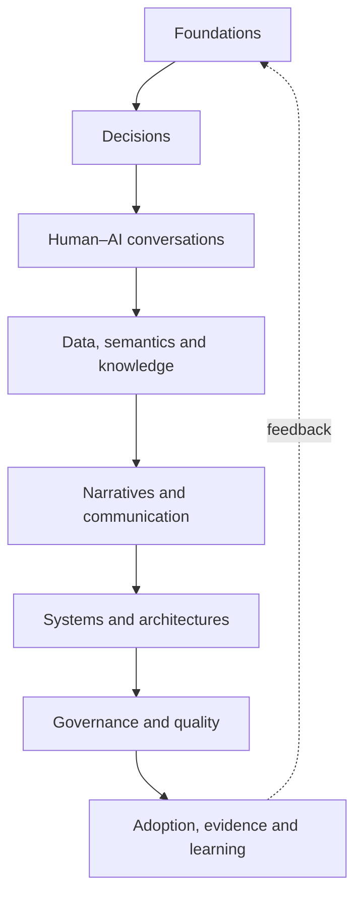

# CDI-BoK domain map

The CDI-BoK organizes **29 domains in eight areas**. Areas support navigation and governance; domains preserve intellectual boundaries. The map does not claim equal maturity or require pages merely to fill the taxonomy.

This shows common dependencies, not a required sequence.

## Area 1 — Foundations and Identity

| Domain | Guiding question | Initial maturity |
|---|---|---|
| **Foundations** | What concepts and sources support coherent CDI language? | Approved project core |
| **Conversational Decision Intelligence** | What makes conversational collaboration genuinely decision-oriented? | Proposed domain |
| **Business Intelligence Evolution** | What capabilities come from reporting, BI, DSS and augmented analytics? | Mature history; candidate synthesis |
| **Future Directions** | What futures are plausible, desirable or risky, under what assumptions? | Exploratory |

## Area 2 — Decisions and Intelligence

| Domain | Guiding question | Initial maturity |
|---|---|---|
| **Decision Intelligence** | How do evidence, judgment, technology, action and feedback coordinate around decisions? | Emerging field |
| **Decision Science** | How should decisions be made, how are they made and how can they improve? | Mature foundations |
| **Behavioral Decision Making** | What biases, heuristics, incentives and contexts shape judgment? | Mature foundations with debate |
| **Decision Quality** | How do we separate process quality, outcome and luck? | Partly established; measurement open |
| **Decision Metrics** | What metrics expose value, risk, latency, calibration and learning? | CDI system under development |

## Area 3 — Conversations and Human–AI Collaboration

| Domain | Guiding question | Initial maturity |
|---|---|---|
| **Conversational Analytics** | How can natural-language exploration preserve semantics and control? | Emerging |
| **Decision Copilots** | How can synthesis, options and workflow be supported while retaining human accountability? | Emerging |
| **Decision Agents** | What actions can be delegated under what limits, observability and stop conditions? | Emerging, high risk |
| **Responsible AI** | What safety, fairness, privacy, transparency and control are required? | Established frameworks; contextual implementation |

## Area 4 — Data, Semantics and Knowledge

| Domain | Guiding question | Initial maturity |
|---|---|---|
| **AI Native Analytics** | What changes when AI participates from design rather than as decoration? | Emerging |
| **Semantic Layers** | How are definitions, metrics, entities and relations preserved across interfaces? | Mature, evolving practice |
| **Knowledge Graphs** | When does relational representation improve context, traceability or reasoning? | Mature technology; emerging CDI use |

## Area 5 — Narratives and Communication

| Domain | Guiding question | Initial maturity |
|---|---|---|
| **Decision Narratives** | How should evidence and alternatives be structured for a decision and action? | Candidate synthesis |
| **Narrative Intelligence** | How can narratives that shape understanding and judgment be generated, evaluated and challenged? | Proposed domain |
| **Data Storytelling** | How can evidence be communicated without hiding uncertainty or counterevidence? | Established practice |

## Area 6 — Systems, Agents and Architectures

| Domain | Guiding question | Initial maturity |
|---|---|---|
| **Decision Architectures** | What layers, contracts and flows connect evidence to action and feedback? | Candidate synthesis |
| **Decision Systems** | How do people, rights, processes, models, interfaces and controls operate together? | Mature adjacent foundations |
| **PULSE** | How is a decision-centered cycle operationalized with trusted data, context, action and learning? | Project constitutional framework |

## Area 7 — Governance, Quality and Responsibility

| Domain | Guiding question | Initial maturity |
|---|---|---|
| **Decision Governance** | Who may see, recommend, decide, approve, execute, stop and answer? | Approved project core |
| **Decision Patterns** | What reusable structures solve recurring decision situations? | Candidate catalog |
| **Decision Anti-patterns** | What designs create false confidence, blockage, improper automation or faulty learning? | Candidate catalog |

## Area 8 — Adoption, Maturity and Evidence

| Domain | Guiding question | Initial maturity |
|---|---|---|
| **Decision Maturity** | What capability is sufficient without equating maturity with technology? | Model under development |
| **Enterprise Implementation** | How can roles, process, data, technology and incentives change sustainably? | Contextual practice |
| **Case Studies** | What happened when CDI or PULSE was applied, with what baseline and limits? | Evidence pending |
| **Research** | What claims are supported, disputed or untested? | Permanent function |

## Editorial activation rule

A domain gains or expands a public page only for a real need and when it can state: decision or capability strengthened; concept owned or applied; source and evidence class; relationship to PULSE; owner and audience; limits and risks; validation and review criteria.

## Critical dependencies

Conversational Analytics depends on trusted data, semantics, permissions and traceability. Decision Copilots additionally need a decision object, criteria, uncertainty and Human-in-Control. Decision Agents require executable limits, observability, stop conditions, escalation and harm assessment. Case Studies require baseline, intervention, horizon, outcome and attribution limits. Future Directions cannot treat analyst or vendor predictions as inevitable facts.

## Change control

Adding, merging, renaming or retiring a domain changes intellectual architecture and requires an ADR. Moving a page without changing conceptual ownership is a minor editorial decision.
