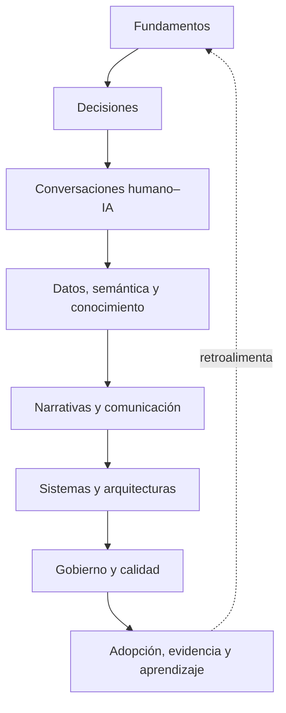

# Mapa de dominios del CDI-BoK

El CDI-BoK organiza **29 dominios en ocho áreas**. Las áreas sirven a navegación y gobernanza; los dominios conservan fronteras intelectuales. El mapa no afirma que todos los dominios tengan igual madurez ni obliga a crear páginas para llenar una taxonomía.

## Lógica de la arquitectura

El diagrama expresa dependencias frecuentes, no una secuencia obligatoria. Una decisión concreta puede requerir solo una parte del mapa.

## Área 1 — Foundations and Identity

| Dominio | Pregunta rectora | Madurez inicial |
|---|---|---|
| **Foundations** | ¿Qué conceptos y fuentes permiten construir CDI con lenguaje coherente? | Núcleo candidato |
| **Conversational Decision Intelligence** | ¿Qué hace que una colaboración conversacional sea verdaderamente decisional? | Dominio propuesto |
| **Business Intelligence Evolution** | ¿Qué capacidades heredamos de reportes, BI, DSS y analítica aumentada? | Campo histórico maduro; síntesis candidata |
| **Future Directions** | ¿Qué futuros son plausibles, deseables o riesgosos y bajo qué supuestos? | Exploratorio |

## Área 2 — Decisions and Intelligence

| Dominio | Pregunta rectora | Madurez inicial |
|---|---|---|
| **Decision Intelligence** | ¿Cómo se coordinan evidencia, juicio, tecnología, acción y feedback alrededor de decisiones? | Campo emergente |
| **Decision Science** | ¿Cómo deberían tomarse, cómo se toman y cómo pueden mejorarse las decisiones? | Fundamentos maduros |
| **Behavioral Decision Making** | ¿Qué sesgos, heurísticas, incentivos y contextos afectan el juicio? | Fundamentos maduros con debates |
| **Decision Quality** | ¿Cómo separar calidad de proceso, resultado y suerte? | Parcialmente establecido; medición abierta |
| **Decision Metrics** | ¿Qué métricas revelan valor, riesgo, latencia, calibración y aprendizaje? | Sistema CDI por desarrollar |

## Área 3 — Conversations and Human–AI Collaboration

| Dominio | Pregunta rectora | Madurez inicial |
|---|---|---|
| **Conversational Analytics** | ¿Cómo preguntar y explorar evidencia en lenguaje natural sin debilitar semántica ni control? | Emergente |
| **Decision Copilots** | ¿Cómo asistir síntesis, opciones y workflow manteniendo accountability humana? | Emergente |
| **Decision Agents** | ¿Qué acciones pueden delegarse, con qué límites, observabilidad y stop conditions? | Emergente y de alto riesgo |
| **Responsible AI** | ¿Qué condiciones de seguridad, justicia, privacidad, transparencia y control exige el uso de IA? | Marcos consolidados; implementación contextual |

## Área 4 — Data, Semantics and Knowledge

| Dominio | Pregunta rectora | Madurez inicial |
|---|---|---|
| **AI Native Analytics** | ¿Cómo cambia el sistema analítico cuando la IA participa desde diseño y no como capa decorativa? | Emergente |
| **Semantic Layers** | ¿Cómo preservar definiciones, métricas, entidades y relaciones a través de interfaces? | Práctica madura en evolución |
| **Knowledge Graphs** | ¿Cuándo una representación relacional mejora contexto, trazabilidad o razonamiento? | Tecnología madura; uso CDI emergente |

## Área 5 — Narratives and Communication

| Dominio | Pregunta rectora | Madurez inicial |
|---|---|---|
| **Decision Narratives** | ¿Cómo estructurar evidencia y alternativas para una decisión y acción concretas? | Síntesis candidata |
| **Narrative Intelligence** | ¿Cómo generar, evaluar y cuestionar narrativas que cambian comprensión y juicio? | Dominio propuesto |
| **Data Storytelling** | ¿Cómo comunicar evidencia visual y verbalmente sin ocultar incertidumbre o contraevidencia? | Práctica establecida |

## Área 6 — Systems, Agents and Architectures

| Dominio | Pregunta rectora | Madurez inicial |
|---|---|---|
| **Decision Architectures** | ¿Qué capas, contratos y flujos conectan evidencia con acción y feedback? | Síntesis candidata |
| **Decision Systems** | ¿Cómo operan personas, derechos, procesos, modelos, interfaces y controles como un sistema? | Fundamentos adyacentes maduros |
| **PULSE** | ¿Cómo se operacionaliza un ciclo decision-centered con datos confiables, contexto, acción y aprendizaje? | Framework constitucional del proyecto |

## Área 7 — Governance, Quality and Responsibility

| Dominio | Pregunta rectora | Madurez inicial |
|---|---|---|
| **Decision Governance** | ¿Quién puede ver, recomendar, decidir, aprobar, ejecutar, detener y responder? | Núcleo candidato |
| **Decision Patterns** | ¿Qué estructuras reutilizables resuelven situaciones decisionales recurrentes? | Por desarrollar |
| **Decision Anti-patterns** | ¿Qué diseños producen falsa confianza, bloqueo, automatización impropia o aprendizaje erróneo? | Por desarrollar |

## Área 8 — Adoption, Maturity and Evidence

| Dominio | Pregunta rectora | Madurez inicial |
|---|---|---|
| **Decision Maturity** | ¿Qué capacidad es suficiente para una decisión dada sin confundir madurez con tecnología? | Modelo por desarrollar |
| **Enterprise Implementation** | ¿Cómo cambiar roles, procesos, datos, tecnología e incentivos de manera sostenible? | Práctica contextual |
| **Case Studies** | ¿Qué ocurrió al aplicar CDI o PULSE, con qué baseline, intervención, resultado y límites? | Evidencia pendiente |
| **Research** | ¿Qué claims están respaldados, en disputa o sin probar? | Función permanente |

## Regla de activación editorial

Un dominio obtiene o amplía una página pública solo si existe una necesidad real y puede declarar:

1. decisión o capacidad que fortalece;
2. concepto que posee o aplica;
3. fuente y clase de evidencia;
4. relación con PULSE;
5. owner y audiencia;
6. límites y riesgos;
7. criterio de validación y revisión.

## Dependencias críticas

- **Conversational Analytics** depende de Trusted Data, semántica, permisos y trazabilidad.
- **Decision Copilots** dependen además de un objeto decisional, criterios, incertidumbre y Human-in-Control.
- **Decision Agents** requieren límites ejecutables, observabilidad, stop conditions, escalamiento y evaluación de daño.
- **Case Studies** no pueden elevar una demo a evidencia sin baseline, intervención, horizonte, resultado y límites de atribución.
- **Future Directions** no puede convertir predicciones de proveedores o analistas en hechos inevitables.

## Control de cambios

Agregar, fusionar, renombrar o retirar un dominio cambia la arquitectura intelectual y requiere ADR. Mover una página dentro de la navegación sin cambiar propiedad conceptual es una decisión editorial menor.

