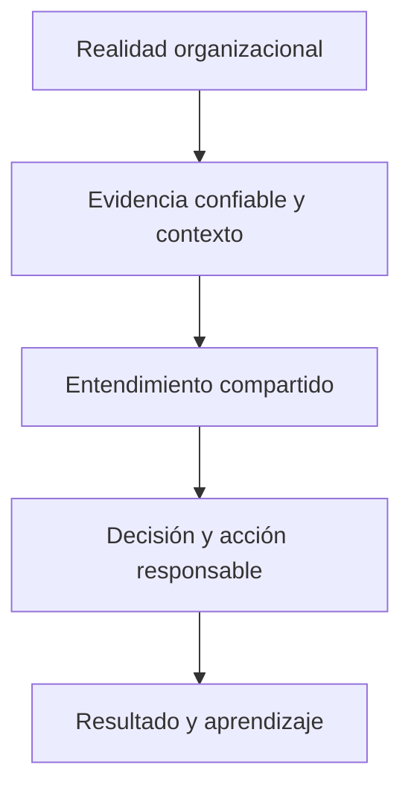

# PULSE

## Definición oficial

> **PULSE is a human-centered Decision Intelligence methodology and operating philosophy that reduces the distance between organizational reality and better decisions by turning trusted data and context into shared understanding, action, and measurable learning.**

Esta formulación pertenece a las fuentes constitucionales de PULSE. La siguiente lectura en español facilita la comprensión, pero no sustituye el texto canónico:

> PULSE es una metodología y filosofía operativa de Decision Intelligence centrada en las personas, que reduce la distancia entre la realidad organizacional y mejores decisiones al convertir datos confiables y contexto en entendimiento compartido, acción y aprendizaje medible.

## Función dentro de CDI

CDI estudia y organiza el campo; el CDI-BoK gobierna el conocimiento; PULSE convierte ese conocimiento en una práctica orientada a decisiones.

## Posiciones que PULSE preserva

- comienza con una decisión que vale la pena mejorar;
- mantiene a las personas responsables de propósito, criterios, riesgo y consecuencias;
- trata los datos como evidencia y el contexto como condición de significado;
- considera dashboards, narrativas, conversaciones y agentes como interfaces posibles;
- cierra el ciclo observando resultados y aprendiendo;
- mide capacidad decisional, no sofisticación tecnológica por sí sola.

## Especificación nuclear

La [Especificación nuclear de PULSE](specification.md) proyecta dentro del CDI-BoK la transformación completa, PDAMR, Decision Circle, cinco verbos, principios, Human-in-Control, selección de interfaces y test de readiness.

!!! info "Contrato de autoridad"
    La especificación es una proyección derivada. El DNA, Documentation Map e Identity canónicos conservan la autoridad sobre PULSE y prevalecen ante cualquier diferencia.
