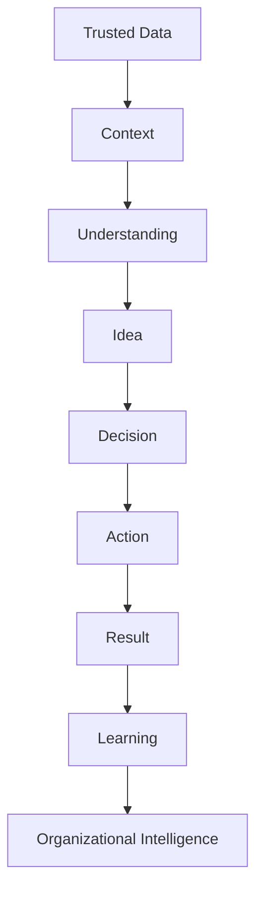

# PULSE core specification

!!! warning "Approved derived authority"
    This specification was approved in `v0.4.0` as the current PULSE core projected into the CDI-BoK. It **does not redefine PULSE**. If wording differs, `00_PULSE_DNA.md`, `00A_PULSE_Documentation_Map.md` and `00_PULSE_Identity.md` prevail for constitutional meaning, documentation governance and public identity respectively.

## Official definition

> **PULSE is a human-centered Decision Intelligence methodology and operating philosophy that reduces the distance between organizational reality and better decisions by turning trusted data and context into shared understanding, action, and measurable learning.**

PULSE is tool- and interface-independent. A report, dashboard, narrative, conversation, copilot, bounded agent or workflow may implement PULSE; none is PULSE by itself.

## Foundational question

> **How can an organization reduce the distance between reality and a better decision—without losing context, responsibility, or the ability to learn?**

The first practical question is: **What decision do we want to improve?**

## Complete transformation

The chain is a conceptual discipline, not a waterfall. The executive shorthand **DATA → IDEA → DECISION** does not remove context, action, result, learning, governance or accountability.

## PDAMR compass

| Element | Required question |
|---|---|
| **Priority** | What material priority must move? |
| **Decision** | What choice must improve, and who owns it? |
| **Action** | What behavior, allocation, rule or workflow will change? |
| **Metric** | What are the baseline, expected change, horizon and attribution limit? |
| **Risk** | What can go wrong, and how will it be governed? |

PDAMR is an orientation compass, not a complete project plan.

## Decision Circle

| Stage | Function | Control question |
|---|---|---|
| **Perceive** | Capture external and internal signals. | What changed, and what capacity do we have to respond? |
| **Focus** | Separate signal from noise and allocate attention. | What can change the decision now? |
| **Anticipate** | Estimate scenarios under uncertainty. | What plausible futures require preparation? |
| **Generate options** | Create paths with assumptions, trade-offs and reversibility. | What real alternatives exist, including no action? |
| **Decide and act** | Commit, assign an owner and execute. | Who decides and acts, under what boundaries? |
| **Learn** | Compare expectation with result and adjust. | What must change in the next cycle? |

The cycle may move backward when new evidence changes the problem. Repetition is not learning.

## Five value verbs

A PULSE initiative must improve at least one:

- **Understand:** reduce ambiguity and expose meaning and uncertainty.
- **Decide:** improve quality, timing, consistency or judgment in a committed choice.
- **Act:** turn a decision into timely, traceable execution.
- **Learn:** alter the next cycle from observed results.
- **Anticipate:** detect signals and prepare before cost rises.

If none improves, the initiative is probably decorative technology.

## Non-negotiable principles

1. **Business First** — begin with a material priority.
2. **Decision First** — design around a choice and owner.
3. **Question First** — start from a human question, not a dataset.
4. **Trust First** — assess fitness for purpose, semantics, provenance and permissions.
5. **Context First** — include process, history, rules, exceptions and local knowledge.
6. **Human-in-Control** — preserve legitimate human authority and ability to stop.
7. **Learning First** — observe results and adjust.
8. **Evidence Before Authority** — prioritize evidence, logic, uncertainty and counterevidence.
9. **Simplicity Before Complexity** — justify every metric, model, visual and interaction.
10. **Conversation as Direction** — use dialogue where it adds value and readiness exists.
11. **Interface Independence** — select the mechanism by decision, context and risk.
12. **Mobile First** — provide the minimum meaningful decision experience on mobile first.
13. **Governance Enables Speed** — turn boundaries and permissions into executable conditions.
14. **Technology Serves Capability** — select technology by the capability it changes.
15. **Value Must Be Observable** — state baseline, metric, horizon and attribution.

## Minimum Decision Experience contract

| Element | Minimum content |
|---|---|
| **User and context** | Role, environment, frequency and time pressure |
| **Decision and owner** | Choice, authority, alternatives and criteria |
| **Evidence** | Sources, definitions, quality, period, filters and provenance |
| **Uncertainty** | Assumptions, limitations, ranges and counterevidence |
| **Action** | Next step, accountable actor, timing, boundaries and escalation |
| **Risk** | Cost of error and delay, reversibility and second-order effects |
| **Metric and feedback** | Baseline, expected result, horizon, actual result and learning |

## Proportional interface selection

| Dominant need | Preferred initial interface | Risk to avoid |
|---|---|---|
| Stable controlled facts | Report | Confusing distribution with decision |
| Recurring monitoring and comparison | Dashboard | KPI excess or no action path |
| Prioritized interpretation | Narrative | Fabricated causality or selective evidence |
| Questions and iterative exploration | Conversation | Fluency without truth, permission or traceability |
| Synthesis, options and workflow support | Copilot | Overconfidence and nominal oversight |
| Repeatable execution with clear rules | Workflow or decision engine | Automating ungoverned exceptions |
| Bounded observable action | Agent | Open objectives, irreversibility or diffuse accountability |

A simple governed form may be more mature than an unreliable agent.

## Human-in-Control

PULSE separates human participation from human control. For material decisions, legitimate people or institutions retain authority over purpose and objectives; criteria and constraints; ethical limits and risk tolerance; data and action permissions; approval, override, stop and escalation; and accountability and consequences. Delegating tasks does not remove this authority. Control must be effective, informed, observable and proportional to possible harm.

## Evidence discipline

PULSE distinguishes **established foundation**, **PULSE synthesis**, **Javier Forero practical point of view**, **aspiration** and **hypothesis**. Organism, pulse, asymmetry, allostasis and interoception are teaching lenses. They do not prove organizations are biological systems or justify ignoring power, incentives, rights or agency.

## Boundaries

PULSE is not a BI tool, dashboard template, chart library, AI product, chatbot, technology maturity ladder, guarantee of truth or doctrine of full autonomy. It does not claim dashboards will disappear on an inevitable date.

## Minimum readiness test

Before using the PULSE name, answer:

1. What priority, decision, owner and action are defined?
2. Is the evidence reliable enough for this use?
3. What context, assumptions and uncertainty are missing?
4. What authority, permissions, stop conditions and accountability exist?
5. What are the costs of error, delay and side effects?
6. What baseline, metric, horizon and expectation will be recorded?
7. How will the result be observed and change the next cycle?
8. Are interface and complexity proportional to user and risk?
9. Can the recommendation or action be challenged, traced and stopped?

If these questions lack sufficient answers, the artifact is not ready to carry the PULSE name.

## Relationship with CDI

CDI supplies the specific focus on conversational Human–AI collaboration. PULSE supplies the decision orientation and complete cycle. A PULSE application may exist without conversation; Conversational Analytics may exist without PULSE; a CDI application in this ecosystem must preserve decision, evidence, action, governance and learning; and PULSE should be extended only when the extension respects its DNA and addresses a need not owned by another document.
