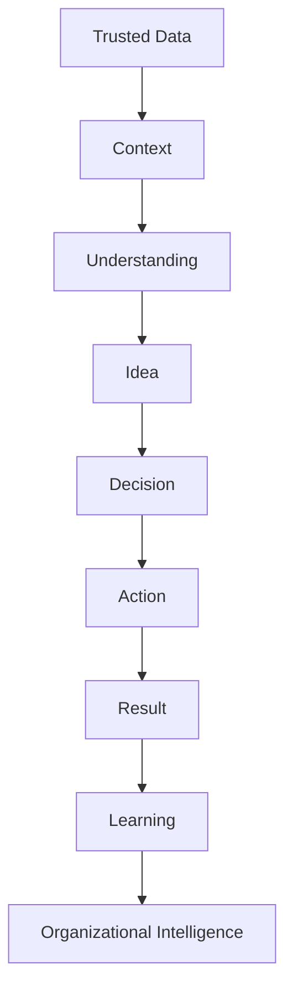

# Especificación nuclear de PULSE

!!! warning "Autoridad aprobada y derivada"
    Esta especificación fue aprobada en `v0.4.0` como proyección del núcleo vigente de PULSE dentro del CDI-BoK. **No redefine PULSE.** Ante cualquier diferencia, prevalecen `00_PULSE_DNA.md`, `00A_PULSE_Documentation_Map.md` y `00_PULSE_Identity.md`, en ese orden para significado constitucional, gobierno documental e identidad pública.

## Definición oficial

> **PULSE is a human-centered Decision Intelligence methodology and operating philosophy that reduces the distance between organizational reality and better decisions by turning trusted data and context into shared understanding, action, and measurable learning.**

PULSE es independiente de herramienta e interfaz. Un reporte, dashboard, narrativa, conversación, copilot, agente acotado o workflow puede implementar PULSE; ninguno de ellos es PULSE por sí mismo.

## Pregunta fundacional

> **How can an organization reduce the distance between reality and a better decision—without losing context, responsibility, or the ability to learn?**

La primera pregunta práctica es:

> **¿Qué decisión queremos mejorar?**

## Transformación completa

La cadena es una disciplina conceptual, no un waterfall. El shorthand ejecutivo **DATA → IDEA → DECISIÓN** no elimina contexto, acción, resultado, aprendizaje, gobernanza ni accountability.

## Brújula PDAMR

| Elemento | Pregunta obligatoria |
|---|---|
| **Priority** | ¿Qué prioridad material debe moverse? |
| **Decision** | ¿Qué elección debe mejorar y quién la posee? |
| **Action** | ¿Qué conducta, asignación, regla o workflow cambiará? |
| **Metric** | ¿Cuál es el baseline, cambio esperado, horizonte y límite de atribución? |
| **Risk** | ¿Qué puede salir mal y cómo se gobernará? |

PDAMR es una brújula de orientación, no un plan de proyecto completo.

## Decision Circle

| Etapa | Función | Pregunta de control |
|---|---|---|
| **Perceive** | Captar señales externas e internas. | ¿Qué cambió y qué capacidad tenemos para responder? |
| **Focus** | Separar señal de ruido y asignar atención. | ¿Qué puede alterar la decisión ahora? |
| **Anticipate** | Estimar escenarios con incertidumbre. | ¿Qué futuros plausibles requieren preparación? |
| **Generate options** | Crear caminos con supuestos, trade-offs y reversibilidad. | ¿Qué alternativas reales existen, incluida no actuar? |
| **Decide and act** | Comprometer una opción, asignar owner y ejecutar. | ¿Quién decide, quién ejecuta y bajo qué límites? |
| **Learn** | Comparar expectativa y resultado y ajustar. | ¿Qué debe cambiar en el siguiente ciclo? |

El ciclo puede retroceder cuando nueva evidencia modifica el problema. Repetición no equivale a aprendizaje.

## Cinco verbos de valor

Una iniciativa PULSE debe mejorar al menos uno de estos verbos:

- **Understand:** reduce ambigüedad y hace visible significado e incertidumbre.
- **Decide:** mejora calidad, timing, consistencia o criterio de una elección comprometida.
- **Act:** convierte una decisión en ejecución oportuna y trazable.
- **Learn:** modifica el siguiente ciclo con base en resultados observados.
- **Anticipate:** detecta señales y prepara respuestas antes de que el costo aumente.

Si no mejora ninguno, probablemente es tecnología decorativa.

## Principios no negociables

1. **Business First** — comenzar por una prioridad material.
2. **Decision First** — diseñar alrededor de una elección y su owner.
3. **Question First** — partir de una pregunta humana, no del dataset.
4. **Trust First** — evaluar fitness for purpose, semántica, procedencia y permisos.
5. **Context First** — incorporar procesos, historia, reglas, excepciones y conocimiento local.
6. **Human-in-Control** — preservar autoridad humana legítima y capacidad de detener.
7. **Learning First** — observar resultados y ajustar.
8. **Evidence Before Authority** — priorizar evidencia, lógica, incertidumbre y contraevidencia.
9. **Simplicity Before Complexity** — justificar cada métrica, modelo, visual e interacción.
10. **Conversation as Direction** — usar diálogo cuando aporta y existe readiness suficiente.
11. **Interface Independence** — elegir el mecanismo según decisión, contexto y riesgo.
12. **Mobile First** — ofrecer primero la experiencia decisional mínima significativa en móvil.
13. **Governance Enables Speed** — convertir límites y permisos en condiciones ejecutables.
14. **Technology Serves Capability** — seleccionar tecnología por la capacidad que cambia.
15. **Value Must Be Observable** — declarar baseline, métrica, horizonte y atribución.

## Contrato mínimo de una Decision Experience

Toda experiencia que lleve el nombre PULSE debe poder declarar:

| Elemento | Contenido mínimo |
|---|---|
| **Usuario y contexto** | Rol, entorno, frecuencia y presión temporal. |
| **Decisión y owner** | Elección, autoridad, alternativas y criterios. |
| **Evidencia** | Fuentes, definiciones, calidad, periodo, filtros y procedencia. |
| **Incertidumbre** | Supuestos, limitaciones, rangos y contraevidencia. |
| **Acción** | Próximo paso, responsable, timing, límites y escalamiento. |
| **Riesgo** | Costo de error, demora, reversibilidad y efectos de segundo orden. |
| **Métrica y feedback** | Baseline, resultado esperado, horizonte, resultado real y aprendizaje. |

## Selección proporcional de interfaz

| Necesidad dominante | Interfaz inicial preferida | Riesgo a evitar |
|---|---|---|
| Hechos estables y controlados | Reporte | Confundir distribución con decisión. |
| Monitoreo recurrente y comparación | Dashboard | Exceso de KPIs o ausencia de acción. |
| Interpretación priorizada | Narrativa | Causalidad fabricada o evidencia selectiva. |
| Preguntas y exploración iterativa | Conversación | Fluidez sin verdad, permisos o trazabilidad. |
| Síntesis, opciones y soporte de workflow | Copilot | Sobreconfianza y supervisión nominal. |
| Ejecución repetible con reglas claras | Workflow o motor de decisiones | Automatizar excepciones no gobernadas. |
| Acción acotada y observable | Agente | Objetivos abiertos, irreversibilidad o accountability difusa. |

Una forma simple y gobernada puede ser más madura que un agente no confiable.

## Human-in-Control

PULSE distingue participación humana de control humano. Para decisiones materiales, humanos o instituciones legítimas conservan autoridad sobre:

- propósito y objetivos;
- criterios y restricciones;
- límites éticos y riesgo tolerable;
- permisos de datos y acción;
- aprobación, override, stop y escalamiento;
- accountability y consecuencias.

Delegar tareas no elimina esa autoridad. El control debe ser efectivo, informado, observable y proporcional al daño posible.

## Disciplina de evidencia

PULSE diferencia:

- **established foundation**;
- **PULSE synthesis**;
- **Javier Forero practical point of view**;
- **aspiration**;
- **hypothesis**.

Las metáforas de organismo, pulso, asimetría, alostasis e interocepción ayudan a enseñar. No prueban que una organización sea un sistema biológico ni justifican ignorar poder, incentivos, derechos o agencia.

## Fronteras

PULSE no es herramienta de BI, template de dashboard, chart library, AI product, chatbot, maturity ladder tecnológica, garantía de verdad ni doctrina de autonomía total. Tampoco sostiene que los dashboards desaparecerán en una fecha inevitable.

## Test de readiness mínimo

Antes de aplicar el nombre PULSE, responda:

1. ¿Qué prioridad, decisión, owner y acción se definen?
2. ¿La evidencia es suficientemente confiable para este uso?
3. ¿Qué contexto, supuestos e incertidumbre faltan?
4. ¿Qué autoridad, permisos, stop conditions y accountability existen?
5. ¿Cuál es el costo del error, de la demora y de los efectos secundarios?
6. ¿Qué baseline, métrica, horizonte y expectativa se registrarán?
7. ¿Cómo se observará el resultado y cambiará el siguiente ciclo?
8. ¿La interfaz y complejidad son proporcionales al usuario y al riesgo?
9. ¿La recomendación o acción puede ser cuestionada, trazada y detenida?

Si estas preguntas no tienen respuesta suficiente, el artefacto no está listo para llevar el nombre PULSE.

## Relación con CDI

CDI aporta el foco específico sobre colaboración conversacional humano–IA. PULSE aporta la orientación decisional y el ciclo completo. La relación no es de equivalencia:

- puede existir una aplicación PULSE sin conversación;
- puede existir Conversational Analytics sin PULSE;
- una aplicación CDI dentro de este ecosistema debe conservar decisión, evidencia, acción, gobierno y aprendizaje;
- PULSE solo debe extenderse cuando la extensión respete su DNA y exista una necesidad no poseída por otro documento.
