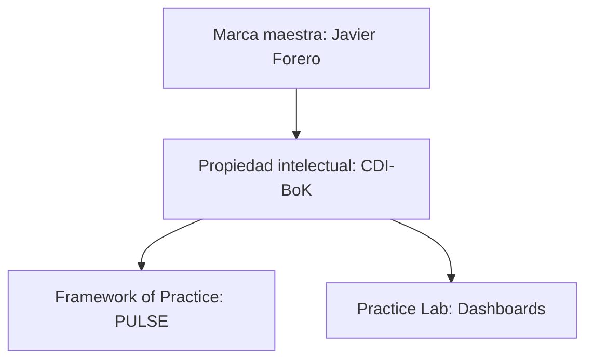
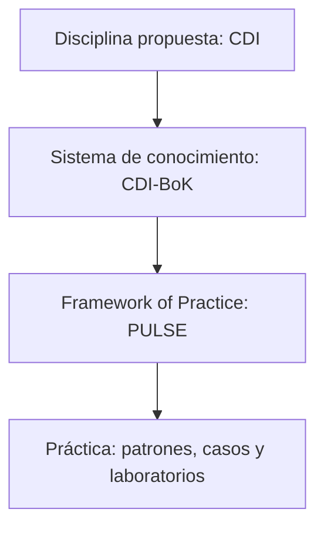
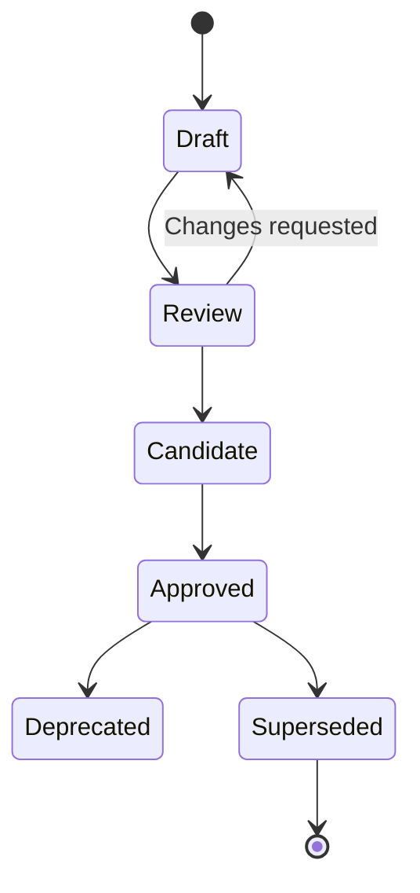
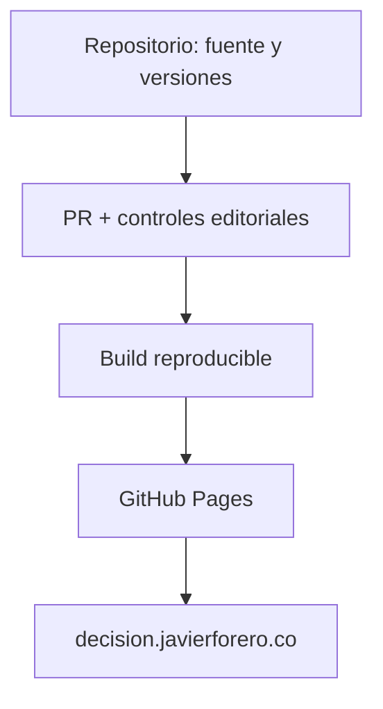

# Arquitectura y gobernanza editorial del CDI-BoK

## 0. Estado y regla de autoridad

Este documento establece la arquitectura intelectual, editorial y técnica inicial del **Conversational Decision Intelligence Body of Knowledge (CDI-BoK)**. Su propósito es impedir que el proyecto crezca como una colección de artículos inconexos, que una formulación persuasiva sea confundida con evidencia o que varias páginas reclamen autoridad sobre el mismo concepto.

Javier Forero ratificó explícitamente la versión `0.2.0` el 19 de julio de 2026. Desde esa decisión, este documento es la norma fundacional `CDI-GOV-001`. Su incorporación al repositorio oficial y el commit de ratificación constituyen el registro técnico de una decisión ya aprobada; no una condición adicional de validez editorial.

La aprobación de este documento no convierte automáticamente a CDI en una disciplina científicamente consolidada, a PULSE en una metodología validada ni al CDI-BoK en un estándar internacional reconocido. Sí establece un sistema transparente para trabajar hacia esas aspiraciones sin presentarlas prematuramente como hechos.

### Cambios incorporados en v0.2.0

Esta versión incorpora el sistema de marca Javier Forero como dependencia transversal del CDI-BoK. Define la arquitectura de marca, la adaptación del branding al portal de conocimiento, los tokens visuales mínimos, los criterios de accesibilidad, la relación estética con `dashboards.javierforero.co` y los controles necesarios para evitar divergencia entre propiedades digitales.

---

## 1. Decisión que gobierna este documento

### PDAMR editorial

| Elemento | Definición para el CDI-BoK |
|---|---|
| **Priority** | Construir un cuerpo de conocimiento coherente, acumulativo, auditable y publicable. |
| **Decision** | Qué contenido entra al CDI-BoK, con qué autoridad, evidencia, ubicación, versión y estado de madurez. |
| **Action** | Aceptar, revisar, devolver, publicar, deprecar o sustituir cada contribución mediante un flujo controlado. |
| **Metric** | Cero conceptos normativos sin owner; cero claims materiales sin clasificación; cero documentos públicos huérfanos; builds reproducibles; trazabilidad entre fuentes, conceptos y versiones. |
| **Risk** | Inflación de originalidad, duplicación, contradicción doctrinal, dependencia de contenido generado por IA, burocracia editorial excesiva y confusión entre demostración y validación. |

### Decisión rectora

> El CDI-BoK se diseñará como un **sistema de conocimiento versionado**, no como una secuencia de capítulos ni como un blog temático.

Cada activo debe tener una función, una autoridad, un owner conceptual, un estado, una versión, una relación con otros activos y evidencia proporcional a sus claims.

---

## 2. Identidad calibrada del ecosistema

### 2.1 Conversational Decision Intelligence

**Definición de trabajo:** CDI es una disciplina integradora propuesta que estudia y diseña cómo personas y sistemas de inteligencia artificial colaboran mediante interfaces conversacionales para comprender evidencia, construir contexto, explorar alternativas, decidir, actuar y aprender bajo incertidumbre.

La definición permanece como **síntesis propuesta** hasta completar:

1. una revisión de antecedentes terminológicos y conceptuales;
2. una delimitación frente a Decision Intelligence, Conversational Analytics, Decision Support Systems, Human-Centered AI y Knowledge Management;
3. una validación con practicantes y académicos externos;
4. evidencia de utilidad práctica en decisiones reales.

### 2.2 CDI-BoK

El CDI-BoK es el sistema versionado que organiza el conocimiento del proyecto CDI. Puede contener definiciones, principios, especificaciones, patrones, guías, investigaciones, casos y contribuciones originales propuestas.

Durante la etapa `0.x` debe presentarse públicamente como:

> **Conversational Decision Intelligence Body of Knowledge — una propuesta abierta y versionada para organizar la práctica emergente de la CDI.**

Se evita llamarlo “estándar internacional” sin reconocimiento o adopción externos verificables. “Construir un estándar internacional” es la misión; no describe todavía su estatus.

### 2.3 PULSE

PULSE es el **framework of practice** del ecosistema: operacionaliza el tránsito desde datos confiables y contexto hasta decisión, acción, resultado y aprendizaje. No reemplaza a CDI ni agota el CDI-BoK.

PULSE tampoco debe ser expandido automáticamente. Toda ampliación debe:

- respetar su DNA constitucional;
- declarar si es doctrina, interpretación, extensión o experimento;
- mantener la decisión como unidad de diseño;
- preservar control humano, trazabilidad, incertidumbre y aprendizaje;
- ser aceptada mediante el proceso de cambio normativo.

### 2.4 Portal oficial y laboratorios prácticos

| Componente | Función | Autoridad |
|---|---|---|
| `decision.javierforero.co` | Portal oficial del **proyecto CDI-BoK** y publicación de su versión vigente. | Publica el conocimiento aprobado; no convierte por sí solo una idea en estándar. |
| Repositorio GitHub del CDI-BoK | Sistema editorial de registro, historial, revisión, releases y fuente de publicación. | Fuente técnica de verdad para versiones aprobadas. |
| `dashboards.javierforero.co` | **Practice Lab** externo con demostraciones de dashboards y experiencias construidas con IA. | Evidencia de diseño y experimentación; no prueba por sí sola eficacia decisional ni validez científica. |
| Fuentes y Deep Research | Corpus de evidencia, antecedentes y perspectivas. | Insumos sujetos a evaluación; no son doctrina por estar almacenados en el proyecto. |

### 2.5 Arquitectura de marca

El CDI-BoK adopta una arquitectura de **marca maestra respaldante** (*endorsed masterbrand*). La marca personal de Javier Forero aporta procedencia, confianza y consistencia; CDI-BoK identifica el cuerpo de conocimiento; PULSE identifica el framework of practice; y el sitio de dashboards materializa demostraciones.



| Nivel de marca | Nombre | Función | Regla visual |
|---|---|---|---|
| **Masterbrand** | Javier Forero | Firma, procedencia y reputación profesional | Siempre visible, pero no debe dominar la lectura normativa |
| **Knowledge property** | CDI-BoK | Nombre del sistema de conocimiento | Identidad tipográfica; no crear un logo independiente sin ADR y activo aprobado |
| **Discipline descriptor** | Conversational Decision Intelligence | Denominación completa del campo propuesto | Aparece completa en primera mención; `CDI` se usa después |
| **Framework** | PULSE | Método de aplicación | Conserva nombre propio; no compite cromática o jerárquicamente con CDI-BoK |
| **Practice extension** | Dashboards para decisiones | Galería y laboratorio | Reutiliza tokens y firma; enlaza al conocimiento que aplica |

#### Regla de equilibrio institucional

El portal no debe parecer un micrositio comercial ni ocultar su autoría personal. La solución es una presencia de marca en tres niveles:

1. **Header:** identificación compacta `Javier Forero` como respaldo, junto con `CDI-BoK` como producto intelectual.
2. **Contenido:** prioridad a la definición, evidencia, estado y versión del activo; sin banners comerciales repetitivos.
3. **Footer:** sello oficial `Javier Forero · javierforero.co`, más enlace al portal profesional cuando corresponda.

La bio completa, servicios y contacto comercial se concentran en `About`. Las páginas normativas no llevan CTAs de venta. Las páginas de práctica pueden incluir un CTA contextual y no invasivo.

### 2.6 Autoridad del sistema de marca

La guía `Javier_Forero_Branding_v2.md` declara que la fuente de verdad es el skill `javier-forero-brand`. Por tanto:

- el skill, cuando esté disponible en el entorno de mantenimiento, gobierna las constantes y activos de marca;
- la guía aportada es la **instantánea normativa legible** registrada como `SRC-BRAND-001`;
- el CDI-BoK conserva una copia versionada de los tokens necesarios para construir el sitio, pero no crea reglas divergentes;
- cada release del sitio registra la versión de marca utilizada;
- un cambio de branding no reescribe automáticamente releases históricos;
- cualquier excepción se documenta mediante ADR.

El nombre de archivo (`Branding_v2`) y la versión declarada dentro de la guía (`1.0`) se registran por separado para evitar ambigüedad de procedencia.

### 2.7 Principios visuales y editoriales vinculantes

El portal debe expresar los cinco atributos de la marca: **ejecutiva, tecnológica, consultiva, humana y premium**. Para CDI-BoK se traducen así:

| Principio | Aplicación en CDI-BoK |
|---|---|
| **Claridad antes que decoración** | La decisión, definición o claim principal debe entenderse antes de explorar detalles. |
| **Jerarquía visible** | Título, estado, versión, autoridad y takeaway preceden el cuerpo extenso. |
| **Confianza observable** | Fuentes, incertidumbre, owner y fecha de revisión son parte del diseño, no notas escondidas. |
| **Acción proporcional** | Cada página termina en siguiente lectura, aplicación, checklist o decisión; no necesariamente en un CTA comercial. |
| **Humanidad sin informalidad** | Lenguaje claro, ejemplos y narrativas, sin sacrificar precisión normativa. |
| **Premium mediante espacio** | Fondos claros, anchura de lectura controlada y acentos escasos; el morado nunca satura la interfaz. |

La regla de marca “cero alucinación en métricas” se integra a la disciplina de claims: objetivo, impacto esperado, benchmark y resultado observado deben tener etiquetas visual y semánticamente distintas.

### 2.8 Contrato visual mínimo

| Token | Valor oficial | Uso en el portal |
|---|---|---|
| `--purple` | `#4e00ff` | Acento, foco, botón primario y elemento activo |
| `--purple-light` | `#7c4dff` | Gradiente, hover o acento secundario; no texto extenso |
| `--deep-blue` | `#041c59` | Títulos, autoridad, navegación y hero |
| `--vibrant-blue` | `#0048ff` | Enlaces y controles interactivos |
| `--bg` | `#f5f7fb` | Fondo general claro |
| `--white` | `#ffffff` | Superficies y tarjetas |
| `--border` | `#e3e8f5` | Separadores y bordes suaves |
| `--soft-lilac` | `#f6f3ff` | Highlights y badges |
| `--text` | `#1f2937` | Texto principal |
| `--muted` | `#5f6b7a` | Metadata y texto secundario |
| `--font-brand` | `'IgraSans', Aptos, Helvetica, Arial, sans-serif` | Toda la interfaz y contenido |

Reglas de composición:

- 55–70% de la superficie permanece blanca o clara;
- el azul profundo sostiene autoridad y estructura;
- el morado ocupa aproximadamente 5–12% y funciona como acento;
- máximo un gradiente dominante por vista;
- ancho de lectura recomendado de 65–75 caracteres;
- cards con radio 16–22 px, borde suave y sombra mínima;
- botones pill; íconos solo cuando comunican función;
- evitar negros dominantes, fondos recargados, emojis decorativos y estética genérica de IA.

### 2.9 Identidad de componentes del conocimiento

Los componentes visuales deben expresar la arquitectura editorial:

| Componente | Tratamiento |
|---|---|
| **Hero de Home** | Gradiente oficial, propuesta calibrada de CDI-BoK y respaldo Javier Forero |
| **Header de página** | H1 en azul profundo; metadata visible; sin hero gigante repetitivo |
| **Status badge** | Texto explícito `Proposed`, `Candidate`, `Approved`, etc.; no depender solo del color |
| **Claim block** | Clase, fuerza de evidencia, confianza y fuente en una unidad escaneable |
| **Insight block** | Fondo lila y borde izquierdo morado para síntesis o takeaway |
| **Warning / limitation** | Etiqueta textual e ícono funcional; no introducir un color semántico nuevo sin ADR |
| **Original Contribution** | Badge visible con estado de revisión; nunca usarlo como sello de novedad confirmada |
| **Decision / action block** | Opción, impacto, riesgo y owner; diferenciado de la evidencia |
| **Version banner** | Solo para Candidate, Deprecated o Superseded; la versión vigente no necesita ruido permanente |
| **Footer** | Sello de marca, versión del sitio y enlaces de gobernanza |

### 2.10 Accesibilidad y adaptación al motor MkDocs

La consistencia visual no justifica sacrificar accesibilidad. El objetivo inicial de conformidad es **WCAG 2.2 nivel AA**, combinando pruebas automáticas y revisión humana.

Requisitos mínimos:

- contraste verificado en tema claro y oscuro;
- navegación completa por teclado y foco visible;
- estructura semántica de encabezados;
- alternativas textuales para imágenes y diagramas;
- color nunca como único portador de significado;
- reflow sin scroll horizontal de página;
- controles de al menos 44×44 px cuando corresponda;
- respeto por `prefers-reduced-motion`;
- pruebas a 320/360, 768 y 1024+ px;
- tablas contenidas o adaptadas en móvil;
- contenido legible sin depender de la fuente descargable.

La guía de marca propone diccionarios JavaScript para artefactos HTML autocontenidos. En MkDocs se conserva el **resultado**, no necesariamente el mecanismo:

- las ediciones ES/EN se mantienen como archivos versionados vinculados, no como dos doctrinas independientes;
- el selector de idioma cambia entre páginas equivalentes y actualiza `lang` y metadata;
- el tema puede persistirse con almacenamiento seguro, pero el contenido normativo no se inyecta mediante JavaScript;
- IgraSans se sirve preferiblemente como activo local del repositorio, si su licencia permite redistribución; de lo contrario se utiliza la URL autorizada y los fallbacks oficiales.

---

## 3. Arquitectura del conocimiento

### 3.1 Cuatro estratos



Los estratos no representan una jerarquía de calidad. Representan funciones distintas:

- **CDI** delimita el campo que se propone estudiar.
- **CDI-BoK** organiza lo que se sabe, propone, discute y aprende.
- **PULSE** guía la aplicación.
- **Práctica** somete las ideas a situaciones observables.

### 3.2 Áreas de conocimiento y dominios

Los 29 dominios iniciales se conservan, pero se agrupan en ocho áreas para evitar una navegación plana y duplicativa.

| ID | Área de conocimiento | Dominios contenidos |
|---|---|---|
| **KA-01** | Foundations and Lineage | Foundations; Decision Intelligence; Decision Science; Behavioral Decision Making; Business Intelligence Evolution |
| **KA-02** | CDI Core | Conversational Decision Intelligence; Conversational Analytics; AI Native Analytics |
| **KA-03** | PULSE Practice | PULSE |
| **KA-04** | Decision Systems and Architecture | Decision Architectures; Decision Systems; Semantic Layers; Knowledge Graphs |
| **KA-05** | Human–AI Collaboration | Decision Copilots; Decision Agents |
| **KA-06** | Decision Experience and Narratives | Decision Narratives; Narrative Intelligence; Data Storytelling |
| **KA-07** | Governance, Quality and Measurement | Decision Governance; Responsible AI; Decision Quality; Decision Metrics; Decision Maturity |
| **KA-08** | Practice, Adoption and Evolution | Decision Patterns; Decision Anti-patterns; Enterprise Implementation; Case Studies; Research; Future Directions |

#### Reglas de dominio

1. Cada activo tiene **un dominio primario** y puede tener varios dominios relacionados.
2. Cada concepto normativo tiene **un único documento owner**.
3. Los demás documentos enlazan al owner y no vuelven a redefinirlo.
4. Añadir, fusionar, dividir o retirar un dominio requiere un Architecture Decision Record (ADR).
5. “Emergente” no significa “superior”; expresa madurez de evidencia.
6. Los dominios `Decision Agents`, `Decision Experience` y `AI Native Analytics` deben mostrar una advertencia visible sobre su evidencia aún cambiante.

### 3.3 Tipos de activos

| Código | Tipo | Propósito | Puede ser normativo |
|---|---|---|---|
| **CH** | Charter / Constitution | Identidad, alcance, principios y límites constitucionales | Sí |
| **STD** | Standard / Specification | Definiciones, requisitos y criterios de conformidad | Sí |
| **FW** | Framework | Modelo operacional con entradas, proceso, controles y resultados | Sí, si se aprueba |
| **GUIDE** | Guidance | Recomendaciones adaptables a contexto | No |
| **PAT** | Pattern | Solución reusable para un problema recurrente | No |
| **ANTI** | Anti-pattern | Práctica recurrente que produce resultados indeseables | No |
| **RES** | Research Note | Estado de evidencia, tensiones y agenda de investigación | No |
| **CASE** | Case Study | Aplicación y resultados observados en un contexto delimitado | No |
| **DEMO** | Demonstration | Prototipo o ejemplo funcional sin inferencia de efectividad general | No |
| **OC** | Original Contribution Proposal | Propuesta de aporte propio pendiente de contraste y validación | No, hasta aprobación |
| **ADR** | Architecture Decision Record | Decisión de arquitectura o gobierno y sus trade-offs | Sí para el sistema editorial |
| **SRC** | Source Record | Registro bibliográfico, procedencia y evaluación de una fuente | No |

### 3.4 El mapa documental como control contra duplicaciones

El archivo `governance/content-map.yml` debe registrar para cada activo:

- ID estable;
- título y slug;
- tipo de activo;
- dominio primario y dominios relacionados;
- owner conceptual;
- estado y versión;
- autoridad y condición normativa;
- dependencias;
- conceptos que posee;
- documentos que sustituye o por los que fue sustituido;
- fuentes obligatorias;
- ubicación publicada.

Ningún documento entra a navegación pública si no existe en este mapa. Ningún concepto puede figurar como propiedad normativa de dos documentos simultáneamente.

---

## 4. Jerarquía de autoridad

### 4.1 Orden propuesto

1. **Constitución CDI-BoK aprobada.** Identidad, misión, alcance, límites y disciplina de claims.
2. **DNA constitucional vigente de PULSE.** Máxima autoridad sobre PULSE.
3. **Gobernanza y mapa documental aprobados.** Definen cómo se crea, cambia y retira conocimiento.
4. **Glosario y registro terminológico normativo.** Un término, una definición owner y aliases controlados.
5. **Estándares y frameworks aprobados.** Incluye la especificación operativa de PULSE.
6. **Guías, patrones y anti-patrones aprobados.** Orientan sin imponer conformidad universal.
7. **Casos, demos y research notes.** Aportan evidencia contextual o exploración.
8. **Fuentes externas y corpus histórico.** Informan, pero no gobiernan.
9. **Borradores, contenido superseded y propuestas de IA.** No tienen autoridad vigente.

### 4.2 Regla de conflicto

Cuando dos fuentes discrepan:

1. no se elige silenciosamente la más reciente o persuasiva;
2. se registra la tensión;
3. se compara autoridad, evidencia, alcance y fecha;
4. se crea un ADR o Change Proposal si la diferencia afecta doctrina;
5. el documento de menor autoridad no reescribe al de mayor autoridad;
6. si la evidencia nueva desafía la doctrina, se modifica la doctrina mediante gobernanza, no mediante una excepción oculta.

### 4.3 Fuentes constitucionales incorporadas

Como parte de la ratificación y del Sprint 0 se localizaron, verificaron e incorporaron al registro de fuentes los documentos `00_PULSE_DNA.md`, `00A_PULSE_Documentation_Map.md` y `00_PULSE_Identity.md`. La identidad canónica corresponde a la versión interna `2.0.0`, que declara sustituida la versión `1.0` anterior. Estos tres documentos gobiernan cualquier contenido normativo sobre PULSE según la jerarquía definida en la sección 4.1; las fuentes históricas o derivadas no los reemplazan.

---

## 5. Auditoría inicial del corpus disponible

| Source ID | Archivo | Naturaleza | Uso permitido | Riesgo o acción pendiente |
|---|---|---|---|---|
| **SRC-BRAND-001** | `Javier_Forero_Branding_v2.md` | Instantánea consolidada del sistema de marca Javier Forero | Norma de integración visual y editorial del portal mientras corresponda a la fuente de verdad declarada | La guía declara al skill `javier-forero-brand` como fuente superior. Registrar por separado nombre de archivo y versión interna; validar licencia de redistribución de IgraSans. |
| **SRC-JF-001** | `Los fundamentos técnicos de PULSE.md` | POV original de Javier sobre asimetría, alostasis e interocepción | Fuente primaria del punto de vista del autor | La copia termina a mitad de una frase. Recuperar el archivo completo. Tratar metáforas organizacionales como hipótesis, no mecanismos probados. |
| **SRC-JF-002** | `La IA Conversacional Revoluciona Dashboards y Analítica.md` | Artículo divulgativo | Antecedente editorial sobre analítica conversacional | Contiene beneficios amplios sin soporte bibliográfico visible. No usar como evidencia de confiabilidad, democratización o reducción de errores. |
| **SRC-JF-003** | `PULSE tómale el pulso a tus decisiones.md` | POV original y explicación pedagógica de PULSE | Fuente primaria de metáforas, Decision Circle y posicionamiento divulgativo | La copia está truncada. La frase “toda decisión siempre sigue el mismo recorrido” requiere calibración como modelo propuesto, no ley universal. |
| **SRC-JF-004** | `arquitectura-de-datos-moderna-fabula_.md` | Fábula pedagógica asistida por IA | Ejemplo de narrativa y explicación accesible | No es una especificación técnica. La simplificación “nada se rechaza” en un data lake no debe convertirse en recomendación de gobierno. |
| **SRC-JF-005** | `ia-datos-analitica-valor-decisiones.md` | POV original de Javier | Fuente primaria de PDAMR, cinco verbos, Human-in-Control y orientación al valor | Las cifras de consultoras y cualquier afirmación temporal deben reverificarse antes de republicar. |
| **SRC-JF-006** | `analitica-datos-5-niveles_.md` | Framework pedagógico de Javier | Clasificación útil de capacidades analíticas | Puede entrar en tensión con la crítica de PULSE a la “escalera”. Gobernarlo como taxonomía de preguntas/capacidades, no como progreso obligatorio. |
| **SRC-DR-001** | `Gemini_Building the Future of Decision Intelligence.md` | Síntesis de investigación generada por IA | Mapa de candidatos, conceptos y referencias por verificar | Lenguaje hiperbólico (“definitive”, “irreversible”, “absolute”), inferencias fuertes y fuentes de calidad desigual. No es fuente normativa ni revisión sistemática. |
| **SRC-DR-002** | `claude-deep-research-pulse` | Síntesis crítica generada por IA | Mapa de evidencia y madurez; guía de investigación | Es la fuente secundaria más cauta del corpus, pero sigue requiriendo verificación contra originales y no sustituye revisión por pares. |
| **SRC-ARCH-001** | `PULSE_Arquitectura_Conceptual_Fase2.md` | Síntesis arquitectónica derivada | Candidato principal para ontología de decisión, capas y Human-in-Control | Alta alineación con la disciplina de claims, pero no adquiere autoridad constitucional hasta revisión y aprobación. |

### Conclusión de la auditoría

El corpus es suficiente para diseñar la **infraestructura de conocimiento**, pero insuficiente para afirmar que CDI ya es una disciplina consolidada, que sus contribuciones son novedosas a escala internacional o que PULSE produce mejores resultados de manera generalizable.

---

## 6. Disciplina de claims y evidencia

### 6.1 Clases de claim

| Código | Clase | Uso correcto |
|---|---|---|
| **EST** | Fundamento establecido | Resultado respaldado por un cuerpo de evidencia maduro y pertinente. |
| **EVD** | Evidencia observada | Dato o resultado verificable dentro de un alcance declarado. |
| **ATT** | Afirmación atribuida | Claim de una fuente externa presentado con autor y contexto. |
| **SYN** | Síntesis CDI/PULSE | Integración propuesta a partir de conceptos existentes. |
| **POV** | Punto de vista de Javier | Juicio autoral explícito, no confundido con consenso. |
| **HYP** | Hipótesis | Proposición falsable pendiente de validación. |
| **ASP** | Aspiración | Estado futuro deseado. |
| **REC** | Recomendación | Acción sugerida basada en evidencia, supuestos y trade-offs. |
| **MET** | Metáfora | Recurso explicativo que no opera como mecanismo causal. |
| **UNK** | Desconocido | Pregunta abierta o evidencia insuficiente. |

### 6.2 Fuerza de evidencia

| Nivel | Descripción | Ejemplos |
|---|---|---|
| **E0** | Sin evidencia externa | Intuición, idea, borrador generado por IA |
| **E1** | Evidencia experiencial o comercial | Experiencia profesional, caso de proveedor, encuesta de analista |
| **E2** | Evidencia secundaria | Revisión narrativa, libro de práctica, síntesis no sistemática |
| **E3** | Evidencia primaria pertinente | Estudio revisado por pares, estándar técnico, fuente oficial, datos reproducibles |
| **E4** | Cuerpo convergente de evidencia | Revisión sistemática, metaanálisis, replicación o consenso técnico maduro |

El nivel no reemplaza el juicio: un estudio E3 irrelevante para el contexto puede sostener peor un claim que evidencia E2 directamente aplicable. Toda evaluación debe considerar población, unidad de análisis, contexto, periodo, método, sesgo, incertidumbre y transferibilidad.

### 6.3 Registro de claims

Los claims materiales deben aparecer en `governance/registries/claims.yml` con, como mínimo:

```yaml
- claim_id: CLM-CDI-0001
  statement: "Texto exacto o formulación canónica"
  class: HYP
  evidence_level: E1
  scope: "Contexto al que aplica"
  concept_owner: CDI-CONCEPT-0001
  supporting_sources: [SRC-XXXX]
  counterevidence: []
  assumptions: []
  uncertainty: "Qué no se sabe"
  confidence: low
  what_would_change_it: "Evidencia que modificaría la conclusión"
  status: proposed
  owner: "Javier Forero"
  last_reviewed: 2026-07-19
```

### 6.4 Prohibiciones editoriales

Salvo evidencia directa y alcance explícito, no se publicarán formulaciones como:

- “CDI demuestra…”;
- “PULSE garantiza…”;
- “es el primero” o “es único”;
- “la era de BI terminó”;
- “los dashboards son obsoletos”;
- “humano + IA siempre supera al humano”;
- “los agentes autónomos son el nivel máximo inevitable”;
- “científicamente validado”;
- “estándar internacional reconocido”.

Formulaciones preferidas:

- “CDI propone…”;
- “la hipótesis del CDI-BoK es…”;
- “PULSE integra…”;
- “este patrón está diseñado para…”;
- “la evidencia disponible sugiere, bajo estas condiciones…”;
- “esta demostración ilustra; no valida por sí sola…”.

---

## 7. Contribuciones originales

La etiqueta **Original Contribution** no debe operar como proclamación de novedad. Designa una propuesta propia cuya originalidad todavía debe evaluarse.

### 7.1 Estados de una contribución

1. `idea`
2. `proposed`
3. `prior-art-reviewed`
4. `practice-tested`
5. `externally-reviewed`
6. `adopted`
7. `revised` o `retired`

### 7.2 Requisitos mínimos

Toda contribución propuesta debe declarar:

- problema específico que intenta resolver;
- componentes que recombina;
- antecedentes y soluciones adyacentes;
- diferencia precisa frente a esos antecedentes;
- mecanismo esperado;
- límites de aplicabilidad;
- hipótesis falsables;
- plan de validación;
- riesgos de primer y segundo orden;
- condiciones que harían preferible otra alternativa.

Una combinación de elementos existentes puede ser valiosa y original en su arquitectura sin ser una teoría científica nueva. El CDI-BoK debe poder decirlo con precisión.

---

## 8. Modelos editoriales por tipo de contenido

La estructura extensa propuesta originalmente para “cada artículo” contiene componentes valiosos, pero aplicarla completa a todo contenido produciría repetición y fatiga. La arquitectura adopta **plantillas diferenciadas**.

### 8.1 Concepto o estándar normativo

1. Propósito
2. Definición canónica
3. Alcance y exclusiones
4. Términos relacionados
5. Principios o requisitos
6. Criterios de conformidad
7. Evidencia y procedencia
8. Limitaciones y preguntas abiertas
9. Relación con CDI, CDI-BoK y PULSE
10. Historial de cambios

### 8.2 Framework

1. Problema y decisión objetivo
2. Supuestos y precondiciones
3. Entradas
4. Componentes o etapas
5. Outputs
6. Roles y decision rights
7. Controles y riesgos
8. Métricas y feedback
9. Patrones y anti-patrones
10. Ejemplo y límites

### 8.3 Research Note

1. Pregunta
2. Método y criterios de inclusión
3. Estado del arte
4. Calidad de evidencia
5. Hallazgos
6. Contradicciones
7. Implicaciones para CDI/PULSE
8. Gaps y agenda futura
9. Referencias

### 8.4 Pattern / Anti-pattern

1. Contexto
2. Problema
3. Fuerzas y trade-offs
4. Solución o comportamiento problemático
5. Consecuencias
6. Evidencia
7. Ejemplo
8. Alternativas
9. Relación con PULSE

### 8.5 Case Study

1. Contexto y decisión
2. Baseline
3. Intervención
4. Datos y método
5. Resultado esperado
6. Resultado observado
7. Atribución e incertidumbre
8. Riesgos y efectos secundarios
9. Aprendizajes
10. Transferibilidad

### 8.6 Demonstration

1. Propósito didáctico
2. Decisión ilustrada
3. Datos reales, sintéticos o simulados
4. Capacidades demostradas
5. Capacidades no demostradas
6. Relación con PULSE
7. Limitaciones
8. Enlace y versión

---

## 9. Metadatos obligatorios

Todo archivo público debe incluir frontmatter validable:

```yaml
id: CDI-<TYPE>-<NNNN>
title: "Título estable"
status: draft | review | candidate | approved | deprecated | superseded
artifact_type: concept | standard | framework | guide | pattern | research | case | demo
authority_level: constitutional | normative | guidance | evidence | experimental
normative: true | false
version: 0.1.0
owner: "Nombre"
reviewers: []
language: es
translation_of: null
primary_domain: KA-XX
related_domains: []
concepts_owned: []
source_ids: []
claim_ids: []
depends_on: []
supersedes: []
created: YYYY-MM-DD
last_reviewed: YYYY-MM-DD
next_review: YYYY-MM-DD | event-driven
```

Los IDs no cambian cuando cambia un título o slug. Los enlaces internos deben preferir IDs o rutas canónicas registradas.

---

## 10. Gobernanza editorial

### 10.1 Roles

| Rol | Responsabilidad | Autoridad inicial |
|---|---|---|
| **Founder and Editor-in-Chief** | Custodia misión, alcance, doctrina y releases | Javier Forero; única autoridad de aprobación durante la etapa inicial |
| **Knowledge Architect** | Mantiene taxonomía, mapa documental, IDs y relaciones | Puede ser ejercido por Javier con asistencia técnica |
| **Scientific Editor** | Evalúa evidencia, claims, métodos y referencias | Rol funcional; idealmente revisión externa para claims mayores |
| **Domain Steward** | Revisa coherencia dentro de un área de conocimiento | Se asigna cuando exista comunidad contribuyente |
| **Practitioner Reviewer** | Evalúa utilidad, aplicabilidad y carga operativa | Recomendado para frameworks y casos |
| **Technical Maintainer** | Build, CI, accesibilidad, enlaces, seguridad y releases | Javier o colaborador designado |
| **AI Editorial Contributor** | Investiga, compara, propone, redacta y audita | Sin voto, sin autoridad normativa y sin capacidad de autoaprobar sus contribuciones |

La gobernanza inicial es deliberadamente ligera: varias responsabilidades pueden ser ejercidas por la misma persona, pero cada revisión debe declarar **qué rol** se está ejerciendo. No se simula la existencia de un comité que todavía no existe.

### 10.2 Derechos de decisión

| Decisión | Propone | Revisa | Aprueba |
|---|---|---|---|
| Corrección ortográfica o enlace | Cualquier contribuidor | Technical Maintainer | Editor-in-Chief o regla automatizada |
| Nueva guía, patrón o demo | Autor / AI contributor | Knowledge Architect + Practitioner Reviewer | Editor-in-Chief |
| Nueva definición normativa | Domain Steward / Editor | Scientific Editor + Knowledge Architect | Editor-in-Chief |
| Cambio a PULSE | Autor | Revisión contra DNA + Scientific Editor | Javier como owner de PULSE |
| Nueva Original Contribution | Autor | Prior-art + práctica + revisión externa cuando sea material | Editor-in-Chief |
| Cambio constitucional o release mayor | Editor-in-Chief | Revisión pública o externa documentada | Editor-in-Chief mediante ADR/RFC |

### 10.3 Flujo editorial



#### Criterios por estado

- **Draft:** incompleto; puede cambiar sin aviso; no aparece en navegación pública estable.
- **Review:** estructura completa; evidencia y claims aún en evaluación.
- **Candidate:** cumple controles internos; está abierto a observaciones antes de ratificación.
- **Approved:** forma parte de la versión vigente.
- **Deprecated:** sigue disponible, pero no se recomienda para trabajo nuevo.
- **Superseded:** reemplazado por un activo identificado; se conserva para trazabilidad.

### 10.4 Cambios normativos

Un cambio normativo requiere:

1. issue o RFC con la decisión propuesta;
2. descripción del problema;
3. alternativa actual y alternativas descartadas;
4. impacto en definiciones, PULSE, dominios, navegación y versiones;
5. claims y evidencia afectados;
6. riesgo de compatibilidad conceptual;
7. plan de migración y enlaces de redirección;
8. aprobación explícita;
9. changelog.

---

## 11. Versionado

### 11.1 Tres versiones distintas

| Capa | Ejemplo | Qué representa |
|---|---|---|
| **Versión del activo** | `CDI-FW-0003 v0.4.1` | Evolución de un documento individual |
| **Release del CDI-BoK** | `cdi-bok-v0.3.0` | Conjunto coherente de activos aprobados |
| **Deployment del sitio** | SHA + fecha | Build técnico publicado; puede no cambiar contenido normativo |

No deben confundirse. Una corrección de CSS puede generar un nuevo deployment sin crear una nueva versión intelectual del CDI-BoK.

### 11.2 Semántica de release

- **MAJOR:** cambio incompatible en identidad, alcance, definición central, taxonomía o PULSE.
- **MINOR:** nuevo dominio, framework, patrón o contenido sustantivo compatible.
- **PATCH:** corrección editorial, enlace, metadato o aclaración que no cambia significado normativo.

Durante `0.x`, el sistema está en formación y puede cambiar significativamente. `v1.0.0` solo debe publicarse cuando existan:

- constitución y glosario aprobados;
- PULSE incorporado desde fuentes canónicas;
- taxonomía estable;
- proceso de claims operativo;
- al menos una revisión externa documentada;
- al menos un caso real con resultado y límites explícitos;
- build y release reproducibles.

### 11.3 Política Git

- `main`: única fuente vigente aprobada.
- ramas `feature/*`, `research/*`, `rfc/*` y `fix/*`: trabajo temporal mediante PR.
- tags firmados o protegidos: releases del CDI-BoK.
- GitHub Releases: notas, cambios normativos, migraciones y archivos descargables.
- ningún branch histórico funciona como doctrina paralela;
- contenido superseded permanece accesible por tag y, cuando convenga, por archivo web claramente rotulado.

---

## 12. Arquitectura técnica de publicación

### 12.1 Decisión recomendada

Usar un repositorio público dedicado —nombre propuesto: `conversational-decision-intelligence-bok`— con **Markdown + MkDocs Material + GitHub Actions + GitHub Pages**.

Razones:

- orientación natural a documentación estructurada;
- contenido legible directamente desde GitHub;
- navegación, búsqueda y referencias cruzadas;
- despliegue estático, reproducible y de bajo costo;
- experiencia previa de Javier con MkDocs;
- posibilidad de añadir validaciones y versionado público cuando sea necesario.

Alternativas:

| Opción | Ventaja | Costo o riesgo | Veredicto inicial |
|---|---|---|---|
| **MkDocs Material** | Content-first, rápido y familiar | i18n y versiones públicas requieren diseño adicional | Recomendada |
| **Docusaurus** | Versionado e internacionalización más integrados | Mayor complejidad JavaScript y migración de práctica existente | Alternativa si bilingual/version switch domina desde el inicio |
| **Sitio custom** | Control visual total | Alto costo de mantenimiento; distrae del conocimiento | No recomendado para v0.x |

### 12.2 GitHub no es el backend de aplicación

En esta arquitectura, GitHub cumple cuatro funciones:

1. sistema de registro editorial;
2. historial y comparación de versiones;
3. workflow de revisión y release;
4. fuente del build estático.

GitHub Pages entrega archivos estáticos. No ejecuta lógica de servidor, bases de datos ni agentes conversacionales. Si más adelante el portal incorpora un copiloto CDI, deberá definirse una arquitectura separada, con fuentes gobernadas, trazabilidad, límites de acción y costos. La conversación no debe añadirse antes de tener un corpus semánticamente estable.

### 12.3 Flujo de publicación



GitHub Pages admite dominios personalizados y subdominios configurados mediante DNS. GitHub también soporta workflows personalizados de Actions para construir y desplegar cualquier generador estático. MkDocs recomienda conservar el archivo `CNAME` dentro de `docs_dir` para que sobreviva a cada build. Véanse las fuentes técnicas oficiales al final.

### 12.4 Versiones visibles y versiones archivadas

#### Etapa inicial recomendada

- `decision.javierforero.co` muestra la última release aprobada.
- Git tags y GitHub Releases conservan todas las versiones fuente.
- La página “Versiones” publica changelog y enlaces a releases.
- Los borradores no aparecen en producción.

#### Etapa posterior

Cuando exista una versión estable y una necesidad real de consultar documentación histórica, se puede usar `mike` o una solución equivalente para publicar versiones inmutables en rutas como `/0.9/` y `/1.0/`, con alias `latest`. Introducir el selector antes de tener dos versiones relevantes añade complejidad sin valor para el lector.

### 12.5 Estructura propuesta del repositorio

```text
conversational-decision-intelligence-bok/
├── .github/
│   ├── workflows/
│   │   ├── validate.yml
│   │   └── deploy-pages.yml
│   ├── ISSUE_TEMPLATE/
│   └── pull_request_template.md
├── docs/
│   ├── CNAME
│   ├── index.md
│   ├── start-here/
│   ├── 00-foundation/
│   ├── 01-foundations-lineage/
│   ├── 02-cdi-core/
│   ├── 03-pulse/
│   ├── 04-systems-architecture/
│   ├── 05-human-ai-collaboration/
│   ├── 06-decision-experience/
│   ├── 07-governance-quality/
│   ├── 08-practice-evolution/
│   ├── practice-lab/
│   ├── research/
│   ├── glossary/
│   ├── versions/
│   └── assets/
│       ├── fonts/
│       ├── brand/
│       ├── images/
│       ├── javascripts/
│       └── stylesheets/
├── brand/
│   ├── README.md
│   ├── brand-source.yml
│   ├── tokens.css
│   ├── tokens.json
│   └── asset-manifest.yml
├── governance/
│   ├── 00_CDI-BoK_Architecture_and_Editorial_Governance.md
│   ├── content-map.yml
│   ├── registries/
│   │   ├── concepts.yml
│   │   ├── claims.yml
│   │   ├── sources.yml
│   │   ├── brand-assets.yml
│   │   └── external-demos.yml
│   ├── adr/
│   └── templates/
├── sources/
│   ├── constitutional/
│   ├── javier-pov/
│   ├── research/
│   └── archived/
├── scripts/
│   ├── audit_content.py
│   ├── validate_frontmatter.py
│   └── validate_registries.py
├── tests/
├── CHANGELOG.md
├── CONTRIBUTING.md
├── LICENSE-CONTENT
├── LICENSE-CODE
├── README.md
├── mkdocs.yml
└── requirements.lock
```

### 12.6 Navegación pública

1. **Home** — promesa calibrada y acceso por necesidad del lector.
2. **Start Here** — qué es CDI, qué no es y cómo usar el BoK.
3. **Foundations** — linaje, fronteras y evidencia.
4. **CDI-BoK** — áreas y dominios.
5. **PULSE** — framework of practice.
6. **Practice Lab** — patrones, casos, demos y dashboards.
7. **Research** — estado del arte, debates y gaps.
8. **Governance** — autoridad, claims, versiones y contribución.
9. **About** — autoría, colaboradores, transparencia y contacto.

El lector no debe enfrentarse inicialmente a 29 opciones de igual peso. Las ocho áreas y rutas por necesidad reducen carga cognitiva.

### 12.7 Implementación del design system

La implementación visual debe centralizarse en tokens y componentes, no en estilos aislados por página.

#### Fuente única de tokens en el repositorio

- `brand/brand-source.yml`: versión y procedencia de la guía/skill utilizado.
- `brand/tokens.json`: representación independiente del motor.
- `brand/tokens.css`: variables consumidas por MkDocs.
- `brand/asset-manifest.yml`: nombre, licencia, checksum, uso y versión de fuentes, logos e imágenes.
- `docs/assets/stylesheets/brand.css`: capa compilada o sincronizada para el sitio.
- `docs/assets/stylesheets/cdi-bok.css`: únicamente reglas específicas del portal, construidas sobre los tokens de marca.

No se copian valores HEX en múltiples hojas salvo necesidad técnica documentada. Un cambio de token debe generar revisión visual y entrada de changelog.

#### Sistema de componentes mínimo

1. header y navegación global;
2. hero de Home;
3. encabezado editorial de activo;
4. badges de autoridad, estado, versión y evidencia;
5. callouts de insight, riesgo, limitación y original contribution;
6. cards de dominios, patrones, casos y demos;
7. tablas responsivas;
8. bloques de código, Mermaid y fórmulas;
9. breadcrumbs y navegación anterior/siguiente;
10. footer de marca y gobernanza;
11. selector de idioma cuando exista traducción;
12. selector claro/oscuro derivado de la marca.

#### Criterio tipográfico

IgraSans es la fuente primaria. Como solo dispone de peso Regular, la interfaz no debe depender de variaciones tipográficas excesivas: la jerarquía se construye también con tamaño, espacio, color, mayúsculas controladas y geometría. Las mayúsculas y `letter-spacing` se reservan para eyebrows y títulos breves; el cuerpo permanece en caja natural para legibilidad.

#### Tema oscuro

El modo oscuro se deriva del azul profundo y del morado, no de una paleta gris genérica. Debe mantener el mismo significado de los tokens y cumplir contraste. El hero oficial permanece estable en ambos temas. La existencia del tema oscuro no autoriza fondos oscuros permanentes en todas las páginas.

#### Gobernanza de imágenes

- Toda imagen tiene propósito editorial, fuente, licencia, alt text y owner.
- Las imágenes generadas con IA se identifican en metadata.
- Diagramas exactos se producen con Mermaid/SVG o herramientas reproducibles, no mediante generación de imágenes.
- Las capturas de dashboards incluyen fecha y versión de la demo.
- No se adopta iconografía genérica de cerebros, robots, circuitos o “magia de IA” como identidad del campo.

---

## 13. Integración con dashboards.javierforero.co

### 13.1 Posicionamiento

`dashboards.javierforero.co` se incorpora conceptualmente como **CDI Practice Lab: Dashboard and Decision Experience Gallery**. Permanece como sitio y repositorio independientes para evitar acoplar el ciclo de publicación del BoK al de las demostraciones.

El CDI-BoK mantiene un catálogo gobernado de enlaces, no una copia de cada dashboard.

La revisión pública del sitio confirma alineación editorial en elementos como `Javier Forero`, el descriptor `Analítica · IA · Transformación Digital`, el foco en dashboards para decisiones, el criterio analítico sobre la herramienta y el sello final de autor. Esa implementación sirve como referencia de continuidad, pero **no reemplaza** la guía de marca ni una auditoría visual de CSS, tipografía, contraste y comportamiento responsive.

### 13.2 Contrato de integración

Cada demo enlazado debe registrar:

```yaml
- demo_id: DEMO-CDI-0001
  title: "Nombre de la demostración"
  url: "https://dashboards.javierforero.co/..."
  repository_url: null
  decision_supported: "Decisión concreta"
  user: "Usuario o rol"
  primary_domain: KA-XX
  pulse_stages: []
  interface_type: dashboard | conversational-dashboard | narrative | copilot
  data_status: real-public | real-private | synthetic | simulated
  maturity: concept | prototype | pilot | operational
  evidence_status: demonstration | observed-case | evaluated-case
  brand_source_version: "Javier Forero Brand 1.0"
  claims_supported: []
  limitations: []
  last_verified: YYYY-MM-DD
```

### 13.3 Regla de evidencia

- **Dashboard publicado ≠ caso validado.**
- **Interfaz funcional ≠ mejor decisión.**
- **IA utilizada en la construcción ≠ AI-native decision system.**
- **Interacción conversacional ≠ respuesta confiable.**

Para que una demo se convierta en `Case Study` debe documentar, como mínimo: decisión, baseline, intervención, usuario real, resultado esperado, resultado observado, incertidumbre, atribución y aprendizaje.

### 13.4 Experiencia entre dominios

- En el BoK, cada concepto aplicable puede mostrar una tarjeta “See it in practice”.
- En la galería, cada dashboard puede enlazar a “Learn the CDI principle”.
- Se prefieren enlaces y previews ligeros sobre iframes permanentes, por accesibilidad, rendimiento y desacoplamiento.
- Ambos sitios deben compartir nomenclatura de dominios, PULSE y estados de madurez.
- Ambos sitios deben consumir la misma versión declarada de tokens o mantener snapshots verificablemente equivalentes.
- La cabecera, firma, tipografía, paleta, radios y foco visible deben sentirse parte del mismo ecosistema sin hacer las páginas idénticas.
- Si se unifica analítica web, debe existir una taxonomía común de eventos y reglas de privacidad; las métricas de navegación no se confunden con evidencia de mejor decisión.

### 13.5 Consistencia sin acoplamiento

La consistencia se mantiene mediante un **contrato de marca versionado**, no copiando hojas de estilo entre repositorios sin control.

Cada propiedad digital registra:

- versión del sistema de marca;
- tokens adoptados y excepciones;
- fuente IgraSans y su procedencia;
- componentes compartidos;
- fecha de última auditoría visual;
- capturas de referencia en desktop y móvil;
- responsable de sincronización.

Si el ecosistema supera tres propiedades activas con cambios frecuentes, se evaluará crear un paquete compartido `javier-forero-brand-web`. Antes de ese umbral, un paquete añade mantenimiento innecesario; los snapshots versionados son suficientes.

---

## 14. Controles automatizados

Todo pull request debe ejecutar, al menos:

1. `mkdocs build --strict`;
2. validación del frontmatter contra esquema;
3. unicidad de IDs, slugs y concept owners;
4. resolución de `source_ids`, `claim_ids` y dependencias;
5. detección de documentos huérfanos fuera del mapa;
6. verificación de enlaces internos y externos críticos;
7. un H1 por página y jerarquía de encabezados válida;
8. comprobación de referencias bibliográficas;
9. detección de lenguaje prohibido o absoluto para revisión humana;
10. auditoría automatizada de accesibilidad y ausencia de secretos;
11. presencia de la fuente y fallbacks aprobados;
12. validación de tokens contra `brand/tokens.json`;
13. detección de colores, gradientes o tipografías no autorizados;
14. verificación del sello de marca y metadata de versión;
15. visual regression de Home, página normativa, research note y demo card en light/dark y mobile/desktop.

La automatización no puede certificar por sí sola conformidad WCAG 2.2 AA ni calidad visual. Contraste contextual, orden de lectura, semántica, zoom, teclado, responsive y claridad cognitiva requieren revisión humana.

### Definition of Done editorial

Un activo está listo para `approved` cuando:

- responde una necesidad concreta del BoK;
- tiene owner y dominio primario;
- no duplica una definición existente;
- declara alcance, límites y relaciones;
- clasifica claims materiales;
- registra fuentes con calidad evaluada;
- expone incertidumbre y contraargumento cuando son relevantes;
- diferencia demostración, evidencia y recomendación;
- aplica la versión de marca declarada sin excepciones silenciosas;
- mantiene legibilidad, accesibilidad y jerarquía en móvil, desktop, tema claro y oscuro;
- pasa controles automáticos;
- tiene aprobación humana trazable.

---

## 15. Idiomas, licencias y transparencia

### 15.1 Idioma

Debe existir una única fuente canónica por release. No se deben editar dos idiomas en paralelo como si fueran originales independientes.

**Recomendación inicial:** español como idioma canónico durante `0.x`, porque coincide con las fuentes originales y reduce errores conceptuales durante la formación del sistema. Preparar IDs, slugs conceptuales y metadatos para una edición inglesa controlada. Antes de `v1.0`, decidir mediante ADR si:

- el español continúa como edición normativa y el inglés es traducción oficial; o
- el inglés pasa a ser edición normativa internacional y el español se mantiene sincronizado.

### 15.2 Licencias

Decisión pendiente de aprobación:

- contenido: recomendar **CC BY 4.0** si el objetivo prioritario es adopción y atribución;
- código, scripts y ejemplos: recomendar **Apache-2.0** o **MIT**;
- imágenes, marcas y logos: política separada.

No publicar una licencia por inferencia. La elección afecta reutilización, contribuciones y posicionamiento del futuro estándar.

### 15.3 Autoría asistida por IA

Cada página debe declarar cuando la IA haya contribuido materialmente a investigación, redacción, traducción o generación visual. La declaración no sustituye revisión humana ni convierte la IA en autora con autoridad normativa.

---

## 16. Métricas del sistema de conocimiento

### 16.1 Salud editorial

- porcentaje de activos con metadata completa;
- porcentaje de claims materiales registrados;
- porcentaje de conceptos con owner único;
- fuentes primarias frente a secundarias;
- tiempo medio de Draft a Approved;
- número de contradicciones abiertas;
- enlaces rotos y documentos huérfanos;
- antigüedad desde la última revisión por dominio.

### 16.2 Utilidad del portal

- búsquedas con y sin resultado;
- rutas desde concepto hasta práctica;
- clics BoK ↔ Practice Lab;
- feedback “esto me ayudó a decidir/aplicar”;
- retornos a contenidos normativos;
- descargas o citas de releases;
- preguntas frecuentes que revelan gaps semánticos.

Las visitas, páginas vistas y tiempo de sesión describen uso; no demuestran aprendizaje, calidad de decisión ni adopción de CDI.

### 16.3 Evidencia de impacto

Para afirmar valor decisional se necesitan estudios o casos con:

- decisión definida;
- baseline;
- cambio introducido;
- métrica de calidad de proceso y de resultado;
- horizonte;
- factores externos;
- análisis de atribución;
- efectos no deseados;
- comparación con alternativa.

---

## 17. Riesgos y mitigaciones

| Riesgo | Orden | Consecuencia | Mitigación |
|---|---|---|---|
| El BoK crece como blog | Primero | Duplicación y navegación caótica | Mapa documental, IDs y concept owners |
| Branding antes que evidencia | Primero | Pérdida de credibilidad | Claims calibrados y estados visibles |
| IA cita a IA | Segundo | Repetición interna confundida con validación | Ir a fuentes originales y registrar procedencia |
| Gobernanza excesiva | Segundo | La producción se detiene | Controles proporcionales al tipo y riesgo del activo |
| “Original” sin prior art | Primero | Claim de novedad refutable | Pipeline de Original Contribution |
| Demos tratadas como casos | Primero | Sobreestimación de eficacia | Contrato explícito de demo y criterios de promoción |
| Escalera tecnológica | Segundo | Conversación y agentes impuestos a decisiones simples | Selección de interfaz por decisión; Simplicity Before Complexity |
| Versiones paralelas no gobernadas | Primero | No se sabe qué es vigente | `main`, tags, Releases y páginas superseded |
| Sitio estático confundido con sistema conversacional | Primero | Expectativas técnicas falsas | Separar portal de cualquier futura capa de servicio |
| Traducciones divergentes | Segundo | Dos doctrinas incompatibles | Una fuente canónica y traducciones ligadas a release |
| Deriva visual entre dominios | Primero | El ecosistema parece una colección de sitios inconexos | Contrato de marca, tokens versionados y auditoría cruzada |
| Marca personal sobredimensionada | Segundo | El BoK parece promoción comercial y pierde autoridad institucional | Firma persistente pero discreta; CTAs comerciales fuera de páginas normativas |
| Branding usado como prueba de calidad | Segundo | Estética confundida con rigor | Mantener separadas conformidad visual, calidad de evidencia e impacto decisional |
| Dependencia externa de la fuente | Primero | Flash de tipografía, indisponibilidad o tracking innecesario | Autohospedar IgraSans si la licencia lo permite y mantener fallbacks |
| Dependencia de Javier como único aprobador | Segundo | Cuello de botella y continuidad limitada | Incorporar stewards y revisión externa progresivamente |

---

## 18. Decisiones abiertas que requieren ADR

| ADR | Decisión | Recomendación |
|---|---|---|
| **ADR-001** | Nombre del repositorio | `conversational-decision-intelligence-bok` |
| **ADR-002** | Idioma canónico | Español durante `0.x`; decisión internacional antes de `v1.0` |
| **ADR-003** | Licencia de contenido y código | CC BY 4.0 + Apache-2.0, sujeto a aprobación |
| **ADR-004** | Visibilidad de drafts | Solo previews de PR; producción publica Approved y Candidate claramente rotulado |
| **ADR-005** | Versiones históricas públicas | Tags/Releases primero; selector web después de la primera versión estable |
| **ADR-006** | Relación con dashboards | Repositorio separado + catálogo gobernado + enlaces bidireccionales |
| **ADR-007** | Definición canónica de CDI | Mantener como propuesta hasta revisión comparativa de antecedentes |
| **ADR-008** | Umbral de Original Contribution | Prior-art + prueba práctica + revisión externa para adopción normativa |
| **ADR-009** | Arquitectura de marca | Javier Forero como masterbrand respaldante; CDI-BoK, PULSE y Practice Lab subordinados |
| **ADR-010** | Fuente y distribución de IgraSans | Activo local si la licencia lo permite; URL autorizada + fallbacks si no |
| **ADR-011** | Conformidad de accesibilidad | WCAG 2.2 AA como objetivo de release, con verificación automática y manual |

---

## 19. Secuencia de implementación

### Sprint 0 — Constitución y control

1. Aprobar o corregir `CDI-GOV-001`.
2. Crear el repositorio.
3. Incorporar las fuentes constitucionales de PULSE.
4. Registrar `SRC-BRAND-001` y la fuente de verdad del sistema de marca.
5. Crear `content-map.yml`, `concepts.yml`, `claims.yml`, `sources.yml` y `brand-assets.yml`.
6. Resolver ADR-001 a ADR-011.

**Salida:** sistema de autoridad y repositorio listo; todavía no se redactan capítulos extensos.

### Sprint 1 — Infraestructura publicable

1. Configurar MkDocs y la navegación vacía controlada.
2. Crear el snapshot de tokens, asset manifest, IgraSans y componentes base.
3. Implementar tema claro/oscuro, responsive y accesibilidad WCAG 2.2 AA.
4. Crear CI, validadores, visual regression, PR template y workflow de Pages.
5. Configurar `decision.javierforero.co`, DNS, HTTPS y `CNAME`.
6. Publicar Governance, Versioning, About y Start Here.

**Salida:** portal mínimo, transparente y técnicamente reproducible.

### Sprint 2 — Núcleo fundacional mínimo

1. Constitución CDI-BoK.
2. Alcance y fronteras de CDI.
3. Glosario normativo inicial.
4. Mapa de dominios.
5. Especificación vigente de PULSE basada en fuentes canónicas.

**Salida:** primera release candidata `v0.1.0`.

### Sprint 3 — Práctica y evidencia

1. Catálogo de `dashboards.javierforero.co`.
2. Seleccionar una demo para convertirla en caso instrumentado.
3. Documentar decisión, baseline, acción, resultado y aprendizaje.
4. Crear el primer ciclo BoK → práctica → evidencia → revisión.

**Salida:** evidencia inicial de utilidad, sin generalización prematura.

---

## 20. Registro de ratificación de esta arquitectura

Javier Forero ratificó esta arquitectura como `approved` y `normative` el 19 de julio de 2026. La ratificación confirma:

1. la jerarquía de autoridad;
2. las ocho áreas y 29 dominios;
3. los tipos de activos;
4. el sistema de claims y evidencia;
5. los roles y derechos de decisión;
6. la política de versiones;
7. MkDocs + GitHub Pages como arquitectura inicial;
8. `dashboards.javierforero.co` como Practice Lab externo;
9. el idioma canónico provisional;
10. las decisiones de licencia o su permanencia como ADR abierto;
11. la arquitectura de marca respaldante;
12. la guía Javier Forero Brand como dependencia transversal;
13. WCAG 2.2 AA como objetivo de accesibilidad;
14. la política de distribución de IgraSans o su permanencia como ADR abierto.

La ejecución del Sprint 0 debe generar un commit identificable y una entrada en `CHANGELOG.md`. Si la publicación remota no está disponible en el entorno de ejecución, el commit local y el paquete reproducible se conservarán como evidencia pendiente de primer `push`.

---

## 21. Referencias técnicas de publicación

- [GitHub Docs — About custom domains and GitHub Pages](https://docs.github.com/en/pages/configuring-a-custom-domain-for-your-github-pages-site/about-custom-domains-and-github-pages)
- [GitHub Docs — Using custom workflows with GitHub Pages](https://docs.github.com/en/pages/getting-started-with-github-pages/using-custom-workflows-with-github-pages)
- [GitHub Docs — Configuring a publishing source](https://docs.github.com/en/pages/getting-started-with-github-pages/configuring-a-publishing-source-for-your-github-pages-site)
- [MkDocs — Deploying your docs](https://www.mkdocs.org/user-guide/deploying-your-docs/)
- [mike — Versioned MkDocs documentation](https://github.com/jimporter/mike)
- [W3C — Web Content Accessibility Guidelines (WCAG) 2.2](https://www.w3.org/TR/WCAG22/)

---

## 22. Conclusión ejecutiva

La arquitectura recomendada separa deliberadamente seis cosas que suelen mezclarse:

1. **la aspiración disciplinar** de CDI;
2. **la autoridad editorial** del CDI-BoK;
3. **la aplicación práctica** mediante PULSE;
4. **la evidencia contextual** de casos y demostraciones;
5. **la infraestructura técnica** que publica y versiona el conocimiento;
6. **el sistema de marca** que hace reconocible el ecosistema sin sustituir su rigor.

El principal activo defendible no será el volumen de páginas, sino la coherencia trazable entre definición, evidencia, decisión, práctica, resultado y aprendizaje. La alternativa —publicar capítulos primero y gobernarlos después— produciría velocidad aparente, pero acumularía deuda conceptual que sería costosa de corregir cuando el proyecto gane visibilidad.

### Nivel de confianza

**Medio-Alto.** La arquitectura editorial, la separación de autoridad y la solución GitHub Pages son sólidas para la etapa inicial. La confianza es menor en el posicionamiento disciplinar de CDI, la originalidad internacional de sus futuros frameworks y la política bilingüe, porque requieren investigación y decisiones aún no cerradas.

### Factores que podrían cambiar la conclusión

- disponibilidad de los documentos constitucionales completos de PULSE;
- necesidad inmediata de edición bilingüe y versionado público múltiple;
- participación temprana de una comunidad externa de revisores;
- elección de una licencia restrictiva;
- cambios en el skill `javier-forero-brand` respecto de la instantánea auditada;
- restricciones de licencia para autohospedar IgraSans;
- evidencia de que la audiencia necesita primero un curso secuencial, no un BoK navegable;
- incorporación futura de un servicio conversacional con backend real.

### Acción recomendada

Ratificar este documento con los cambios necesarios y ejecutar **Sprint 0**. No redactar todavía capítulos de dominio: primero registrar las fuentes canónicas de PULSE y de marca, resolver los ADR iniciales y crear los registros de control editorial y visual.
