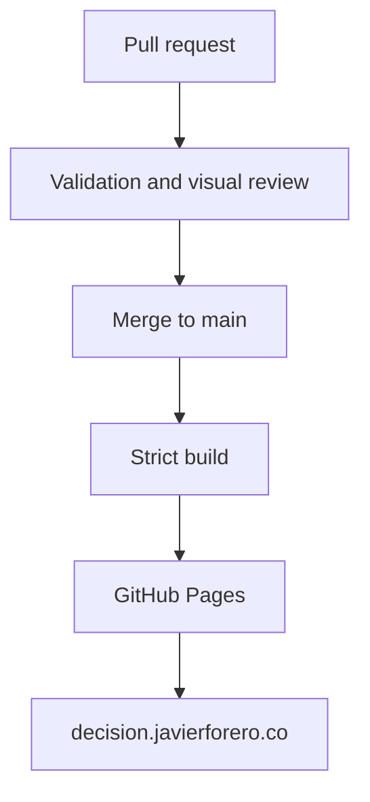

# Publishing and domain

## Architecture



## Initial Pages setup

1. In GitHub, open **Settings → Pages**.
2. Under **Build and deployment**, select **GitHub Actions** as the source.
3. Configure `decision.javierforero.co` as the custom domain before creating DNS.
4. When GitHub recognizes the domain and the certificate is available, enable **Enforce HTTPS**.

## Required DNS

| Type | Name | Target |
|---|---|---|
| `CNAME` | `decision` | `jaforero.github.io` |

Do not use a complete URL, wildcard record or repository name as the target.

## Verification

```bash
dig decision.javierforero.co +noall +answer -t CNAME
curl -I https://decision.javierforero.co
```

DNS changes may take time to propagate. `docs/CNAME` preserves the intended domain in the repository, but a custom workflow does not replace Pages configuration.

## Publishing conditions

- `main` is the only production branch.
- A pull request validates without deploying.
- The build must pass `mkdocs build --strict` and repository audits.
- GitHub Actions on Ubuntu is the canonical reference for Playwright snapshots; baseline updates require explicit visual review in the PR.
- Deployment uses minimum permissions and the `github-pages` environment.
- WCAG conformance may be claimed only after auditing the deployed release.
