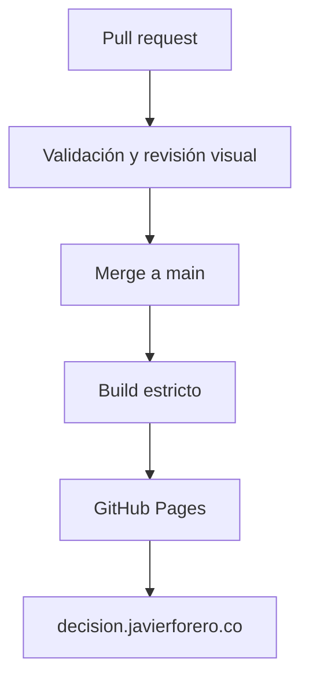

# Publicación y dominio

## Arquitectura



## Activación inicial de Pages

1. En GitHub, abra **Settings → Pages**.
2. En **Build and deployment**, seleccione **GitHub Actions** como fuente.
3. Configure `decision.javierforero.co` como dominio personalizado antes de crear el DNS.
4. Cuando GitHub reconozca el dominio y el certificado esté disponible, active **Enforce HTTPS**.

## DNS requerido

En el proveedor DNS de `javierforero.co`, cree:

| Tipo | Nombre | Destino |
|---|---|---|
| `CNAME` | `decision` | `jaforero.github.io` |

No utilice una URL completa, un registro wildcard ni el nombre del repositorio como destino.

## Verificación

```bash
dig decision.javierforero.co +noall +answer -t CNAME
curl -I https://decision.javierforero.co
```

Los cambios DNS pueden tardar en propagarse. La presencia de `docs/CNAME` conserva el dominio objetivo en el repositorio, pero el workflow personalizado no reemplaza la configuración de Pages.

## Condiciones de publicación

- `main` es la única rama de producción.
- Un pull request valida sin desplegar.
- El build debe pasar `mkdocs build --strict` y las auditorías del repositorio.
- El workflow de deploy utiliza permisos mínimos y el entorno `github-pages`.
- La conformidad WCAG solo puede declararse después de auditar la release desplegada.

