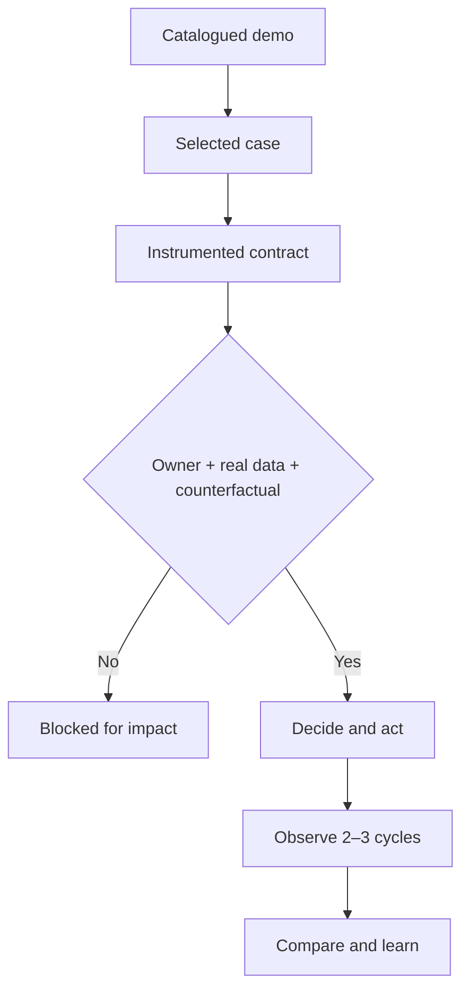

# B2B Proposal case

**Status: instrumented, not executed.** The demo supports definition and audit of the decision; no registered action, later outcome or attributable effect exists.

## The decision

> **Where should we intervene first to recover conversion without unnecessarily increasing acquisition cost?**

The commercial demo uses **simulated data** and shows deterioration concentrated in **Proposal** plus the series' worst monthly compliance in June 2026. The first option to test is a reversible intervention in proposal quality and speed. It has not been chosen or executed.

[View the primary dashboard](https://dashboards.javierforero.co/claude/desempeno-comercial/){ .md-button .md-button--primary }
[Review the contract](decision-contract.md){ .md-button }
[Audit the evidence](evidence-protocol.md){ .md-button }

## What we know about the simulated demo

| Evidence | Reproduced result | Class | Decision strength |
|---|---:|---|---|
| June 2026 weighted compliance | **80.11%** | Calculation | High within simulated dataset |
| Sellers below 90% in June | **8 of 8** | Calculation | High within simulated dataset |
| Proposal conversion, Jan–Mar | **48.03%** | Calculation | Provisional baseline |
| Proposal conversion, Apr–Jun | **36.53%** | Calculation | **−11.50 pp** deterioration |
| Event / referral / inbound win rate | 8.93% / 7.94% / 3.60% | Calculation | Insufficient for superiority; wide overlapping intervals |

!!! danger "What we do not know"
    Whether the signal exists in a real operation; whether an owner accepts intervention; expected improvement; comparability of intervention and control; and observed result. These gaps block impact claims.

## DATA → IDEA → DECISION

| Layer | Calibrated reading |
|---|---|
| **DATA** | June reaches 80.11% of target and Proposal falls 11.50 pp between observed 2026 quarters. |
| **IDEA** | Deterioration appears more concentrated in conversion than volume; Proposal intervention may be more direct and reversible than buying demand. This is inference, not established causality. |
| **DECISION** | Preregister a bounded Option A test with owner, expected range and comparison. Without them, do not execute a pilot claim. |

## PULSE cycle status

`v0.5.0-rc.1` reaches **Instrumented contract** and does not jump to result.

## What the BoK adds

It adds real alternatives including no action; separation of fact, calculation, inference and hypothesis; a frozen pre-action expectation; process-quality assessment without outcome; counterfactual and attribution limits; and a longitudinal record.

## Cycle 0: one recommendation changed

The source described event and referral as significantly superior to digital. Reproduction found higher rates but wide overlapping Wilson intervals. Therefore B and C are blocked, A keeps provisional preference and D remains comparator. Claims discipline corrected an internal recommendation; this does **not** demonstrate commercial impact or PULSE superiority.

## Next gate

The case advances only after owner, selected option, expectation, group assignment and at least two cycles. See the [evidence protocol](evidence-protocol.md) and [cycle record](cycle-log.md).
