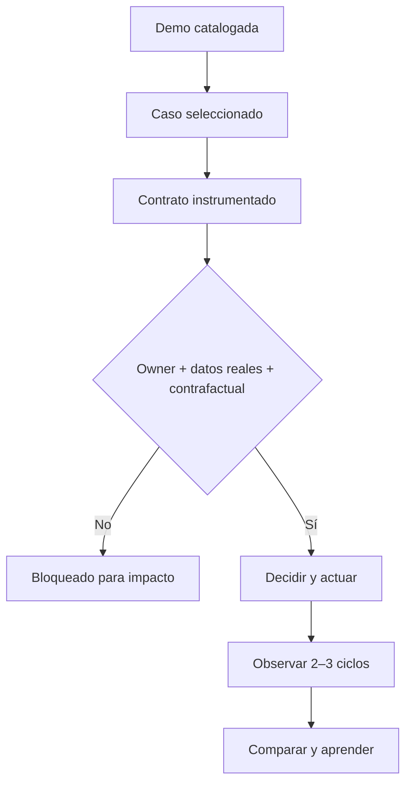

# Caso B2B Propuesta

**Estado: instrumentado, no ejecutado.** El demo permite definir y auditar la decisión; todavía no existe acción registrada, resultado posterior ni efecto atribuible.

## La decisión

> **¿Dónde intervenir primero para recuperar la conversión sin ampliar innecesariamente el costo de adquisición?**

El demo comercial usa **datos simulados** y muestra un deterioro concentrado en la etapa **Propuesta** y el peor cumplimiento mensual de la serie en junio de 2026. La primera opción a probar es una intervención reversible sobre calidad y velocidad de las propuestas. No se ha elegido ni ejecutado todavía.

[Ver el dashboard primario](https://dashboards.javierforero.co/claude/desempeno-comercial/){ .md-button .md-button--primary }
[Revisar el contrato](decision-contract.md){ .md-button }
[Auditar la evidencia](evidence-protocol.md){ .md-button }

## Lo que sabemos —sobre el demo simulado

| Evidencia | Resultado reproducido | Clase | Fuerza para decidir |
|---|---:|---|---|
| Cumplimiento ponderado de junio de 2026 | **80,11%** | Cálculo | Alta dentro del dataset simulado. |
| Vendedores bajo 90% en junio | **8 de 8** | Cálculo | Alta dentro del dataset simulado. |
| Conversión Propuesta, ene–mar | **48,03%** | Cálculo | Baseline provisional. |
| Conversión Propuesta, abr–jun | **36,53%** | Cálculo | Deterioro de **−11,50 pp**. |
| Win rate evento / referido / inbound | 8,93% / 7,94% / 3,60% | Cálculo | Insuficiente para declarar superioridad; intervalos amplios y superpuestos. |

!!! danger "Lo que no sabemos"
    No sabemos si la misma señal existe en una operación real, si un owner aceptará la intervención, cuánto espera mejorar, si el grupo intervenido será comparable con el control ni qué resultado se observará. Esos vacíos bloquean un claim de impacto.

## DATA → IDEA → DECISIÓN

| Capa | Lectura calibrada |
|---|---|
| **DATA** | En el demo, junio alcanza 80,11% de la meta y Propuesta cae 11,50 pp entre los dos trimestres de 2026 observados. |
| **IDEA** | El deterioro parece más localizado en conversión que en volumen; intervenir Propuesta puede ser más directo y reversible que comprar más demanda. Es una inferencia, no causalidad probada. |
| **DECISIÓN** | Preregistrar una prueba acotada de la opción A con owner, expectativa en rango y grupo de comparación. Si esos elementos no existen, no ejecutar el claim de piloto. |

## Estado del ciclo PULSE

El candidato `v0.5.0-rc.1` llega hasta **Contrato instrumentado**. No salta al resultado.

## Qué agrega el BoK sobre el dashboard

El dashboard muestra señal, diagnóstico y acción sugerida. El caso agrega:

1. alternativas reales, incluida no actuar;
2. separación de hecho, cálculo, inferencia e hipótesis;
3. expectativa cuantitativa fijada antes de actuar;
4. evaluación de calidad de proceso sin mirar el resultado;
5. contrafactual y límites de atribución;
6. registro longitudinal para que el resultado cambie el siguiente ciclo.

## Ciclo 0: una recomendación sí cambió

La fuente inicial describía evento y referido como significativamente superiores a digital masivo. La reproducción del baseline mostró tasas mayores, pero intervalos de Wilson al 95% amplios y superpuestos. La revisión produjo una decisión documental concreta:

- **antes:** B podía parecer una reasignación respaldada por evidencia fuerte;
- **después:** B y C quedan bloqueadas; A conserva preferencia provisional y D sigue como comparador;
- **aprendizaje:** distinguir ranking observado de diferencia robusta evita aumentar el costo de error.

Este ciclo `BoK → práctica → evidencia → revisión` demuestra que la disciplina de claims corrigió una recomendación dentro del proyecto. **No demuestra impacto comercial ni superioridad de PULSE.**

## Siguiente gate

El caso solo puede avanzar a `observed-noncausal` o `evaluated` cuando se completen el owner, la opción elegida, la expectativa, la asignación de grupos y al menos dos ciclos. Consulte el [protocolo de evidencia](evidence-protocol.md) y el [registro del ciclo](cycle-log.md).
