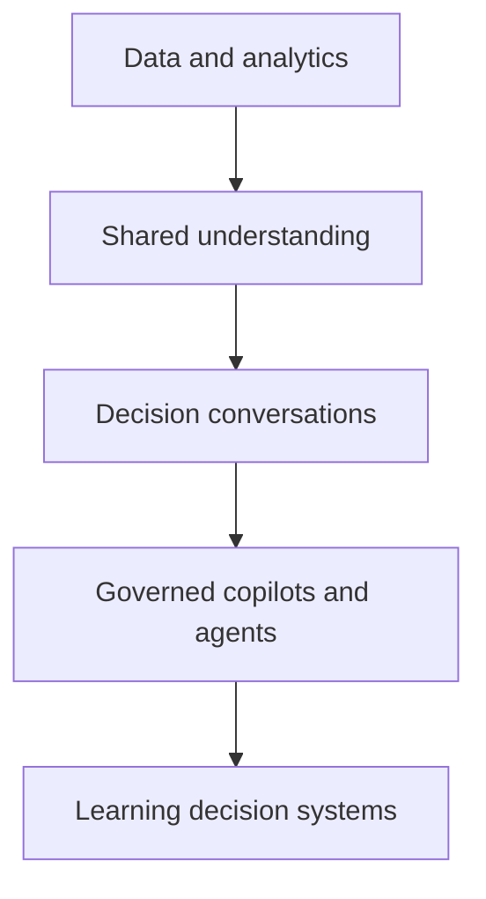

# Start here

## The central idea

**Conversational Decision Intelligence (CDI)** is the proposed interdisciplinary domain of practice that studies and designs how people and AI systems collaborate through conversations to turn trustworthy evidence and context into explicit decisions, responsible action and measurable learning.

The word **proposed** is essential: it defines the field this project seeks to build, but does not replace comparative review, external validation or practical evidence.

## Three levels that must not be confused

| Level | Role | Question answered |
|---|---|---|
| **CDI** | Proposed domain of practice | What must we understand about conversational collaboration for decisions? |
| **CDI-BoK** | Official, versioned knowledge system | How do we organize definitions, evidence, models, patterns and practices? |
| **PULSE** | Framework of practice | How do we move evidence and context toward decision, action and learning? |

## CDI is not

- a chatbot connected to a database;
- a new label for Business Intelligence;
- a dashboard with a question box;
- a promise to automate every decision;
- permission to replace human accountability;
- an internationally recognized standard merely because it is called a Body of Knowledge.

## The evolution studied by the project

This trajectory is an organizing hypothesis, not an inevitable law. Interfaces change; the decision, its context, consequences and accountability remain.

## Continue

- [Learn how to use the CDI-BoK](how-to-use.md).
- [Read the approved Constitution](../00-foundation/constitution.md).
- [Review CDI scope and boundaries](../00-foundation/cdi-scope-boundaries.md).
- [Explore the knowledge architecture](../00-foundation/domain-map.md).
- [Meet PULSE](../03-pulse/index.md).
- [Review the authority system](../governance/index.md).
