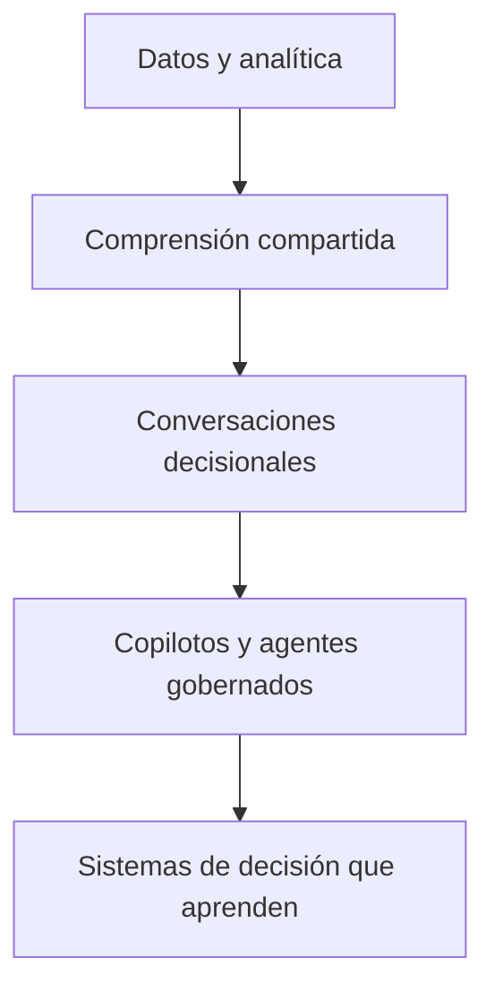

# Empieza aquí

## La idea central

**Conversational Decision Intelligence (CDI)** es el dominio de práctica interdisciplinar propuesto que estudia y diseña cómo personas y sistemas de inteligencia artificial colaboran mediante conversaciones para convertir evidencia confiable y contexto en decisiones explícitas, acción responsable y aprendizaje medible.

La expresión **propuesta** es esencial: define el campo que este proyecto busca construir, pero no sustituye la revisión comparativa, la validación externa ni la evidencia práctica.

## Tres niveles que no deben confundirse

| Nivel | Función | Pregunta que responde |
|---|---|---|
| **CDI** | Dominio de práctica propuesto | ¿Qué debemos comprender sobre la colaboración conversacional para decidir? |
| **CDI-BoK** | Sistema oficial y versionado de conocimiento | ¿Cómo organizamos definiciones, evidencia, modelos, patrones y prácticas? |
| **PULSE** | Framework of practice | ¿Cómo llevamos evidencia y contexto hacia decisión, acción y aprendizaje? |

## CDI no es

- un chatbot conectado a una base de datos;
- una nueva etiqueta para Business Intelligence;
- un dashboard con una caja de preguntas;
- una promesa de automatizar todas las decisiones;
- una autorización para reemplazar responsabilidad humana;
- un estándar internacional reconocido por el solo hecho de llamarse Body of Knowledge.

## La evolución que estudia el proyecto

Esta trayectoria es una hipótesis organizadora, no una ley inevitable. Las interfaces cambian; la decisión, su contexto, sus consecuencias y su responsabilidad permanecen.

## Cómo continuar

- [Aprende a usar el CDI-BoK](how-to-use.md).
- [Lee la Constitución candidata](../00-foundation/constitution.md).
- [Revisa el alcance y las fronteras de CDI](../00-foundation/cdi-scope-boundaries.md).
- [Explora la arquitectura de conocimiento](../00-foundation/domain-map.md).
- [Conoce PULSE](../03-pulse/index.md).
- [Revisa el sistema de autoridad](../governance/index.md).
